# 🚀 DEEPWIKI: GUÍA COMPLETA DE DESARROLLO PHP CON MYSQL

## 📚 Tabla de Contenidos
1. [Análisis de Enunciados](#análisis-de-enunciados)
2. [Patrones de Diseño de Base de Datos](#patrones-de-diseño-de-base-de-datos)
3. [Arquitectura de Aplicaciones PHP](#arquitectura-de-aplicaciones-php)
4. [Flujos de Trabajo Completos](#flujos-de-trabajo-completos)
5. [Patrones de Validación](#patrones-de-validación)
6. [Manejo de Sesiones](#manejo-de-sesiones)
7. [Queries SQL Comunes](#queries-sql-comunes)
8. [Seguridad y Mejores Prácticas](#seguridad-y-mejores-prácticas)
9. [Patrones de UI/UX](#patrones-de-uiux)
10. [Resolución de Problemas](#resolución-de-problemas)

---

## 📋 1. Análisis de Enunciados

### Metodología de Análisis COMPLETO

```mermaid
flowchart TD
    START[Leer Enunciado Completo] --> TABLES[Identificar Tablas]
    TABLES --> FIELDS[Listar Campos por Tabla]
    FIELDS --> RELATIONS[Definir Relaciones]
    RELATIONS --> FLOW[Identificar Flujo de Pantallas]
    FLOW --> VALIDATIONS[Extraer Validaciones]
    VALIDATIONS --> CALCS[Identificar Cálculos]
    CALCS --> OUTPUT[Definir Salidas]
    OUTPUT --> DESIGN[Diseñar Solución]
```



### Checklist de Análisis

**Fase 1: Modelo de Datos**
- [ ] ¿Cuántas tablas se mencionan?
- [ ] ¿Qué campos tiene cada tabla?
- [ ] ¿Cuál es la clave primaria de cada tabla?
- [ ] ¿Qué claves foráneas existen?
- [ ] ¿Qué tipo de datos debe tener cada campo?
- [ ] ¿Hay restricciones CHECK mencionadas?

**Fase 2: Flujo de Aplicación**
- [ ] ¿Cuántas pantallas se mencionan?
- [ ] ¿Qué hace cada pantalla?
- [ ] ¿Qué datos se pasan entre pantallas?
- [ ] ¿Qué operaciones de BD se realizan en cada paso?
- [ ] ¿Hay formularios? ¿Qué campos tienen?
- [ ] ¿Hay listas desplegables? ¿De dónde vienen los datos?

**Fase 3: Lógica de Negocio**
- [ ] ¿Qué cálculos se deben realizar?
- [ ] ¿Qué valores se generan automáticamente?
- [ ] ¿Hay valores aleatorios?
- [ ] ¿Qué consultas históricas se necesitan?

**Fase 4: Validaciones**
- [ ] ¿Qué campos son obligatorios?
- [ ] ¿Hay validaciones de formato (NIF, teléfono, email)?
- [ ] ¿Hay validaciones de rango (fechas, precios)?
- [ ] ¿Hay validaciones de longitud?
- [ ] ¿Hay validaciones de lógica de negocio?

---

## 🗄️ 2. Patrones de Diseño de Base de Datos

### Patrón: Tabla de Entidades Principales

Usuarios, Clientes, Socios, etc.

```sql
CREATE TABLE [Entidad] (
    [entidad]ID INT AUTO_INCREMENT PRIMARY KEY,
    nif VARCHAR(9) NOT NULL UNIQUE,
    nombre VARCHAR(50) NOT NULL,
    telefono VARCHAR(9),
    email VARCHAR(50),
    CONSTRAINT chk_nif CHECK (LENGTH(nif) = 9),
    CONSTRAINT chk_telefono CHECK (telefono IS NULL OR LENGTH(telefono) = 9)
) ENGINE=InnoDB DEFAULT CHARSET=utf8mb4;
```

**Campos comunes**:
- `ID`: INT AUTO_INCREMENT PRIMARY KEY
- `nif`: VARCHAR(9) UNIQUE
- `nombre`: VARCHAR(50) NOT NULL
- `telefono`: VARCHAR(9)
- `email`: VARCHAR(50)

---

### Patrón: Tabla de Recursos

Inmuebles, Actividades, Productos, etc.

```sql
CREATE TABLE [Recurso] (
    [recurso]ID INT AUTO_INCREMENT PRIMARY KEY,
    nombre VARCHAR(50) NOT NULL,
    descripcion VARCHAR(50),
    precio DECIMAL(10,2) NOT NULL,
    fecha_inicio DATE,
    fecha_fin DATE,
    CONSTRAINT chk_precio CHECK (precio > 0),
    CONSTRAINT chk_fechas CHECK (fecha_fin >= fecha_inicio)
) ENGINE=InnoDB DEFAULT CHARSET=utf8mb4;
```

**Campos comunes**:
- `ID`: INT AUTO_INCREMENT PRIMARY KEY
- `nombre`: VARCHAR(50) NOT NULL
- `descripcion`: VARCHAR(50)
- `precio`: DECIMAL(10,2)
- Fechas de validez

---

### Patrón: Tabla de Relaciones (Transacciones)

Reservas, Inscripciones, Pedidos, etc.

```sql
CREATE TABLE [Transaccion] (
    [transaccion]ID INT AUTO_INCREMENT PRIMARY KEY,
    [recurso]ID INT NOT NULL,
    [entidad]ID INT NOT NULL,
    fecha_transaccion DATE NOT NULL,
    precio DECIMAL(10,2) NOT NULL,
    FOREIGN KEY ([recurso]ID) REFERENCES [Recurso]([recurso]ID) ON DELETE CASCADE,
    FOREIGN KEY ([entidad]ID) REFERENCES [Entidad]([entidad]ID) ON DELETE CASCADE
) ENGINE=InnoDB DEFAULT CHARSET=utf8mb4;
```

**Características**:
- Siempre tiene 2+ claves foráneas
- Fecha de transacción
- Puede incluir precio/monto
- ON DELETE CASCADE para integridad

---

### Patrón: Tabla de Valoraciones

Comentarios, Reseñas, Ratings, etc.

```sql
CREATE TABLE [Valoracion] (
    [valoracion]ID INT AUTO_INCREMENT PRIMARY KEY,
    [transaccion]ID INT NOT NULL,
    puntuacion DECIMAL(3,1) NOT NULL,
    comentario VARCHAR(200),
    fecha_valoracion TIMESTAMP DEFAULT CURRENT_TIMESTAMP,
    FOREIGN KEY ([transaccion]ID) REFERENCES [Transaccion]([transaccion]ID) ON DELETE CASCADE,
    CONSTRAINT chk_puntuacion CHECK (puntuacion >= 0 AND puntuacion <= 10)
) ENGINE=InnoDB DEFAULT CHARSET=utf8mb4;
```

**Características**:
- Referencia a transacción/reserva
- Puntuación numérica con rango
- Comentario opcional
- Timestamp automático

---

## 🏗️ 3. Arquitectura de Aplicaciones PHP

### Estructura de Archivos Estándar

```
proyecto/
│
├── database.sql                # Script SQL completo
├── conexion.php               # Configuración de BD
├── index.php                  # Pantalla inicial/selección
├── paso2_[accion].php        # Segunda pantalla
├── confirmacion.php           # Procesamiento y confirmación
├── procesar_[accion].php     # Procesamiento adicional
└── README.md                  # Documentación
```

---

### Patrón: Archivo de Conexión

**Ubicación**: `conexion.php`

```php
<?php
/**
 * Archivo de conexión centralizado
 * Incluir en cada script que necesite acceso a BD
 */

// Parámetros de conexión
$servidor = 'localhost';
$usuario = 'root';
$password = '';
$base_datos = 'nombre_bd';

// Conectar al servidor
$conex = mysqli_connect($servidor, $usuario, $password)
    or die("Error al conectar con el servidor: " . mysqli_error($conex));

// Seleccionar la base de datos
mysqli_select_db($conex, $base_datos)
    or die("Error al seleccionar la base de datos: " . mysqli_error($conex));

// Configurar charset para evitar problemas con acentos
mysqli_set_charset($conex, "utf8mb4");
?>
```

**Ventajas**:
- Centralización de configuración
- Fácil mantenimiento
- Reutilizable en todos los scripts
- Manejo de errores consistente

---

### Patrón: Pantalla de Selección Inicial

**Ubicación**: `index.php`

```php
<?php
/**
 * PANTALLA 1: Selección de entidad principal
 * Ejemplo: Seleccionar usuario/socio/cliente
 */

// 1. Incluir conexión
include 'conexion.php';

// 2. Consultar entidades disponibles
$query = "SELECT [entidad]ID, nombre, nif
          FROM [Entidad]
          ORDER BY nombre";
$resultado = mysqli_query($conex, $query) or die(mysqli_error($conex));

// 3. Verificar que hay datos
$num_registros = mysqli_num_rows($resultado);

// 4. Procesar formulario si se envió
if (isset($_POST['enviar'])) {
    $id_seleccionado = $_POST['[entidad]ID'];
    header("Location: paso2.php");
    exit();
}
?>

<!DOCTYPE html>
<html lang="es">
<head>
    <meta charset="UTF-8">
    <title>Selección de [Entidad]</title>
</head>
<body>
    <h1>Seleccionar [Entidad]</h1>

    <?php if ($num_registros == 0): ?>
        <p>No hay [entidades] registradas en el sistema.</p>
    <?php else: ?>
        <form method="POST" action="index.php">
            <label>Seleccione [entidad]:</label>
            <select name="[entidad]ID" required>
                <option value="">-- Seleccione --</option>
                <?php while ($registro = mysqli_fetch_array($resultado)): ?>
                    <option value="<?php echo $registro['[entidad]ID']; ?>">
                        <?php echo $registro['nombre'] . ' (' . $registro['nif'] . ')'; ?>
                    </option>
                <?php endwhile; ?>
            </select>
            <button type="submit" name="enviar">Continuar</button>
        </form>
    <?php endif; ?>
</body>
</html>

<?php mysqli_close($conex); ?>
```

**Puntos clave**:
- Consulta ordenada alfabéticamente
- Verificación de existencia de datos
- Formato descriptivo en opciones
- Validación HTML5 con `required`

---

### Patrón: Pantalla de Selección de Recursos

**Ubicación**: `paso2_[accion].php`

```php
<?php
/**
 * PANTALLA 2: Selección de recurso y parámetros
 */

session_start();
include 'conexion.php';

// 1. Validar que se recibió ID de la pantalla anterior
if (!isset($_POST['[entidad]ID']) || empty($_POST['[entidad]ID'])) {
    die("Error: No se ha seleccionado ninguna [entidad].");
}

$id_entidad = intval($_POST['[entidad]ID']);
$_SESSION['id_entidad'] = $id_entidad;

// 2. Obtener datos de la entidad seleccionada
$query_entidad = "SELECT nombre, nif FROM [Entidad] WHERE [entidad]ID = $id_entidad";
$resultado_entidad = mysqli_query($conex, $query_entidad);
$datos_entidad = mysqli_fetch_array($resultado_entidad);

// 3. Obtener recursos disponibles (con filtro si es necesario)
$query_recursos = "SELECT [recurso]ID, nombre, precio
                   FROM [Recurso]
                   WHERE [condicion_activo]  -- Ej: fecha_fin >= CURDATE()
                   ORDER BY nombre";
$resultado_recursos = mysqli_query($conex, $query_recursos);
?>

<!DOCTYPE html>
<html lang="es">
<head>
    <meta charset="UTF-8">
    <title>Selección de [Recurso]</title>
    <script>
        // Validación en cliente
        function validarFormulario() {
            var recurso = document.getElementById('recurso').value;
            var fecha = document.getElementById('fecha').value;

            if (!recurso) {
                alert('Por favor, seleccione un [recurso].');
                return false;
            }

            if (!fecha) {
                alert('Por favor, seleccione la fecha.');
                return false;
            }

            // Validar que la fecha sea >= hoy
            var hoy = new Date().toISOString().split('T')[0];
            if (fecha < hoy) {
                alert('La fecha debe ser igual o posterior a hoy.');
                return false;
            }

            return true;
        }

        // Establecer fecha mínima
        window.onload = function() {
            var hoy = new Date().toISOString().split('T')[0];
            document.getElementById('fecha').min = hoy;
        };
    </script>
</head>
<body>
    <h1>Selección de [Recurso]</h1>

    <div class="info-entidad">
        <h3>[Entidad] seleccionada:</h3>
        <p><?php echo $datos_entidad['nombre'] . ' (' . $datos_entidad['nif'] . ')'; ?></p>
    </div>

    <form method="POST" action="confirmacion.php" onsubmit="return validarFormulario()">
        <input type="hidden" name="[entidad]ID" value="<?php echo $id_entidad; ?>">

        <label>Seleccione [recurso]:</label>
        <select name="[recurso]ID" id="recurso" required>
            <option value="">-- Seleccione --</option>
            <?php while ($recurso = mysqli_fetch_array($resultado_recursos)): ?>
                <option value="<?php echo $recurso['[recurso]ID']; ?>">
                    <?php echo $recurso['nombre'] . ' - ' . number_format($recurso['precio'], 2) . '€'; ?>
                </option>
            <?php endwhile; ?>
        </select>

        <label>Fecha:</label>
        <input type="date" name="fecha" id="fecha" required>

        <button type="submit">Continuar</button>
    </form>
</body>
</html>

<?php mysqli_close($conex); ?>
```

**Puntos clave**:
- Usar sesiones para mantener contexto
- Mostrar datos de la entidad seleccionada
- Filtrar recursos activos
- Validación JavaScript + HTML5
- Campo hidden para pasar ID de entidad

---

### Patrón: Pantalla de Confirmación y Procesamiento

**Ubicación**: `confirmacion.php`

```php
<?php
/**
 * PANTALLA 3: Procesar transacción y mostrar confirmación
 */

session_start();
include 'conexion.php';

// ===== 1. VALIDACIÓN DE DATOS =====
$errores = array();

$id_entidad = isset($_POST['[entidad]ID']) ? intval($_POST['[entidad]ID']) : 0;
$id_recurso = isset($_POST['[recurso]ID']) ? intval($_POST['[recurso]ID']) : 0;
$fecha = isset($_POST['fecha']) ? $_POST['fecha'] : '';

// Validaciones básicas
if ($id_entidad <= 0) $errores[] = "ID de [entidad] inválido.";
if ($id_recurso <= 0) $errores[] = "No se seleccionó [recurso].";
if (empty($fecha)) $errores[] = "Fecha no especificada.";

// Validaciones de lógica de negocio
$fecha_actual = date('Y-m-d');
if ($fecha < $fecha_actual) {
    $errores[] = "La fecha debe ser igual o posterior a hoy.";
}

// Si hay errores, mostrar y detener
if (count($errores) > 0) {
    echo "<h2>Errores de validación:</h2><ul>";
    foreach ($errores as $error) {
        echo "<li>$error</li>";
    }
    echo "</ul>";
    echo '<a href="index.php">Volver</a>';
    exit();
}

// ===== 2. OBTENER INFORMACIÓN COMPLETA =====
// Entidad
$query_entidad = "SELECT nombre, nif, telefono, email
                  FROM [Entidad]
                  WHERE [entidad]ID = $id_entidad";
$resultado_entidad = mysqli_query($conex, $query_entidad);
$entidad = mysqli_fetch_array($resultado_entidad);

// Recurso
$query_recurso = "SELECT nombre, descripcion, precio
                  FROM [Recurso]
                  WHERE [recurso]ID = $id_recurso";
$resultado_recurso = mysqli_query($conex, $query_recurso);
$recurso = mysqli_fetch_array($resultado_recurso);

// ===== 3. REALIZAR CÁLCULOS =====
$precio_base = $recurso['precio'];
// Ejemplo: calcular precio con duración
// $precio_total = $precio_base * $duracion;

// Ejemplo: generar valor aleatorio
// $precio_total = rand(10000, 100000) / 100; // 100.00 - 1000.00

// ===== 4. INSERTAR TRANSACCIÓN =====
$query_insert = "INSERT INTO [Transaccion] ([recurso]ID, [entidad]ID, fecha_transaccion, precio)
                 VALUES ($id_recurso, $id_entidad, '$fecha', $precio_total)";

$resultado_insert = mysqli_query($conex, $query_insert);
if (!$resultado_insert) {
    die("Error al registrar transacción: " . mysqli_error($conex));
}

$id_transaccion = mysqli_insert_id($conex);
$_SESSION['id_transaccion'] = $id_transaccion;

// ===== 5. OBTENER HISTORIAL =====
$query_historial = "SELECT t.[transaccion]ID, r.nombre, t.fecha_transaccion, t.precio
                    FROM [Transaccion] t
                    INNER JOIN [Recurso] r ON t.[recurso]ID = r.[recurso]ID
                    WHERE t.[entidad]ID = $id_entidad AND t.[transaccion]ID != $id_transaccion
                    ORDER BY t.fecha_transaccion DESC";
$resultado_historial = mysqli_query($conex, $query_historial);
$num_historial = mysqli_num_rows($resultado_historial);
?>

<!DOCTYPE html>
<html lang="es">
<head>
    <meta charset="UTF-8">
    <title>Confirmación de [Transacción]</title>
</head>
<body>
    <h1>¡[Transacción] Confirmada!</h1>

    <div class="detalles">
        <h2>Datos de [Entidad]</h2>
        <p>Nombre: <?php echo $entidad['nombre']; ?></p>
        <p>NIF: <?php echo $entidad['nif']; ?></p>

        <h2>Datos de [Recurso]</h2>
        <p>Nombre: <?php echo $recurso['nombre']; ?></p>
        <p>Precio: <?php echo number_format($precio_base, 2); ?>€</p>

        <h2>Detalles de la [Transacción]</h2>
        <p>Nº de [Transacción]: #<?php echo $id_transaccion; ?></p>
        <p>Fecha: <?php echo date('d/m/Y', strtotime($fecha)); ?></p>
        <p><strong>PRECIO TOTAL: <?php echo number_format($precio_total, 2); ?>€</strong></p>
    </div>

    <h2>Historial de [Transacciones]</h2>
    <?php if ($num_historial > 0): ?>
        <table>
            <thead>
                <tr>
                    <th>Nº</th>
                    <th>[Recurso]</th>
                    <th>Fecha</th>
                    <th>Precio</th>
                </tr>
            </thead>
            <tbody>
                <?php while ($h = mysqli_fetch_array($resultado_historial)): ?>
                    <tr>
                        <td>#<?php echo $h['[transaccion]ID']; ?></td>
                        <td><?php echo $h['nombre']; ?></td>
                        <td><?php echo date('d/m/Y', strtotime($h['fecha_transaccion'])); ?></td>
                        <td><?php echo number_format($h['precio'], 2); ?>€</td>
                    </tr>
                <?php endwhile; ?>
            </tbody>
        </table>
    <?php else: ?>
        <p>Esta es la primera [transacción]. ¡Bienvenido!</p>
    <?php endif; ?>

    <a href="index.php">Nueva [Transacción]</a>
</body>
</html>

<?php mysqli_close($conex); ?>
```

**Puntos clave**:
- Validación exhaustiva en servidor
- Consultas JOIN para información completa
- Cálculos automáticos
- Historial excluyendo transacción actual
- Formato de fechas y precios

---

## ✅ 4. Patrones de Validación

### Validación en Cliente (JavaScript)

```javascript
/**
 * Template de función de validación completa
 */
function validarFormulario() {
    // 1. Obtener valores
    var campo1 = document.getElementById('campo1').value;
    var campo2 = document.getElementById('campo2').value;

    // 2. Validar campos obligatorios
    if (!campo1 || campo1.trim() === '') {
        alert('El campo 1 es obligatorio.');
        return false;
    }

    // 3. Validar formato (ejemplo: NIF)
    if (campo1.length != 9) {
        alert('El NIF debe tener 9 caracteres.');
        return false;
    }

    // 4. Validar rango (ejemplo: fecha)
    var hoy = new Date().toISOString().split('T')[0];
    if (campo2 < hoy) {
        alert('La fecha debe ser igual o posterior a hoy.');
        return false;
    }

    // 5. Validar lógica entre campos
    if (fecha_salida <= fecha_entrada) {
        alert('La fecha de salida debe ser posterior a la fecha de entrada.');
        return false;
    }

    return true; // Todo OK
}
```

---

### Validación en Servidor (PHP)

```php
/**
 * Template de validación completa en servidor
 */

// Array para almacenar errores
$errores = array();

// 1. Validar existencia de campos
if (!isset($_POST['campo1']) || empty($_POST['campo1'])) {
    $errores[] = "El campo 1 es obligatorio.";
}

// 2. Sanitizar y convertir tipo
$campo1 = isset($_POST['campo1']) ? trim($_POST['campo1']) : '';
$campo2 = isset($_POST['campo2']) ? intval($_POST['campo2']) : 0;
$campo3 = isset($_POST['campo3']) ? floatval($_POST['campo3']) : 0.0;

// 3. Validar formato
if (!empty($campo1) && strlen($campo1) != 9) {
    $errores[] = "El campo 1 debe tener exactamente 9 caracteres.";
}

// 4. Validar rango
if ($campo3 < 0 || $campo3 > 10) {
    $errores[] = "El campo 3 debe estar entre 0 y 10.";
}

// 5. Validar lógica de negocio
$fecha_actual = date('Y-m-d');
$fecha_entrada = $_POST['fecha_entrada'];
if ($fecha_entrada < $fecha_actual) {
    $errores[] = "La fecha de entrada debe ser igual o posterior a hoy.";
}

// 6. Validar contra base de datos (unicidad, existencia)
$query_check = "SELECT [campo]ID FROM [Tabla] WHERE [campo] = '$valor'";
$result_check = mysqli_query($conex, $query_check);
if (mysqli_num_rows($result_check) > 0) {
    $errores[] = "Ya existe un registro con ese valor.";
}

// 7. Mostrar errores si existen
if (count($errores) > 0) {
    echo "<div class='error-box'>";
    echo "<h3>Errores encontrados:</h3><ul>";
    foreach ($errores as $error) {
        echo "<li>$error</li>";
    }
    echo "</ul>";
    echo '<a href="javascript:history.back()">Volver</a>';
    echo "</div>";
    exit();
}

// Si llegamos aquí, todos los datos son válidos
```

---

## 🔐 8. Seguridad y Mejores Prácticas

### Prevención de Inyección SQL

```php
// ❌ MAL - Vulnerable a SQL Injection
$query = "SELECT * FROM Usuario WHERE nombre = '$nombre'";

// ✅ BIEN - Escapar caracteres especiales
$nombre_escapado = mysqli_real_escape_string($conex, $nombre);
$query = "SELECT * FROM Usuario WHERE nombre = '$nombre_escapado'";

// ✅ MEJOR - Usar prepared statements (mysqli)
$stmt = mysqli_prepare($conex, "SELECT * FROM Usuario WHERE nombre = ?");
mysqli_stmt_bind_param($stmt, "s", $nombre);
mysqli_stmt_execute($stmt);
$resultado = mysqli_stmt_get_result($stmt);
```

---

### Prevención de XSS

```php
// ❌ MAL - Mostrar datos directamente
echo "Nombre: " . $_POST['nombre'];

// ✅ BIEN - Escapar HTML
echo "Nombre: " . htmlspecialchars($_POST['nombre']);

// Para atributos HTML
echo '<input type="text" value="' . htmlspecialchars($_POST['nombre'], ENT_QUOTES) . '">';
```

---

### Validación de Tipos

```php
// Convertir a entero (seguro)
$id = intval($_POST['id']); // Devuelve 0 si no es número

// Convertir a float
$precio = floatval($_POST['precio']);

// Validar email
$email = filter_var($_POST['email'], FILTER_VALIDATE_EMAIL);
if ($email === false) {
    $errores[] = "Email inválido.";
}

// Validar entero en rango
$puntuacion = filter_var($_POST['puntuacion'], FILTER_VALIDATE_INT, [
    'options' => ['min_range' => 0, 'max_range' => 10]
]);
if ($puntuacion === false) {
    $errores[] = "Puntuación debe estar entre 0 y 10.";
}
```

---

## 📊 7. Queries SQL Comunes

### Query: Consulta Simple con ORDER BY

```sql
-- Obtener todos los registros ordenados
SELECT [campo]ID, nombre, precio
FROM [Tabla]
ORDER BY nombre ASC;
```

### Query: Consulta con WHERE y Filtros

```sql
-- Filtrar registros activos
SELECT [campo]ID, nombre, fecha_fin
FROM [Tabla]
WHERE fecha_fin >= CURDATE() AND activo = 1
ORDER BY nombre;
```

### Query: JOIN para Obtener Información Relacionada

```sql
-- Historial con información de múltiples tablas
SELECT t.[transaccion]ID, r.nombre as nombre_recurso, e.nombre as nombre_entidad,
       t.fecha_transaccion, t.precio
FROM [Transaccion] t
INNER JOIN [Recurso] r ON t.[recurso]ID = r.[recurso]ID
INNER JOIN [Entidad] e ON t.[entidad]ID = e.[entidad]ID
WHERE t.[entidad]ID = ?
ORDER BY t.fecha_transaccion DESC;
```

### Query: INSERT con Valores Calculados

```php
// INSERT en PHP con valores calculados
$query_insert = "INSERT INTO Reserva (ID_inmueble, ID_usuario, fecha_entrada, fecha_salida)
                 VALUES ($id_inmueble, $id_usuario, '$fecha_entrada', '$fecha_salida')";
mysqli_query($conex, $query_insert);

// Obtener ID auto-generado
$id_reserva = mysqli_insert_id($conex);
```

### Query: Cálculos con Fechas

```php
// Cálculo de diferencia de fechas en PHP
$fecha_entrada_obj = new DateTime($fecha_entrada);
$fecha_salida_obj = new DateTime($fecha_salida);
$diferencia = $fecha_entrada_obj->diff($fecha_salida_obj);
$num_dias = $diferencia->days;

// Cálculo en SQL
SELECT DATEDIFF(fecha_salida, fecha_entrada) as num_dias
FROM Reserva
WHERE ID_Reserva = ?;

// Filtrar por fecha actual en SQL
SELECT * FROM Actividad
WHERE fecha_fin >= CURDATE();
```

---

## 🎨 9. Patrones de UI/UX

### Estructura HTML5 Básica

```html
<!DOCTYPE html>
<html lang="es">
<head>
    <meta charset="UTF-8">
    <meta name="viewport" content="width=device-width, initial-scale=1.0">
    <title>Título de la Página</title>
    <style>
        /* Estilos CSS inline o enlace externo */
    </style>
</head>
<body>
    <div class="container">
        <h1>Título Principal</h1>
        <p class="subtitle">Subtítulo descriptivo</p>

        <!-- Información contextual -->
        <div class="info-box">
            <p>Información importante para el usuario</p>
        </div>

        <!-- Formulario -->
        <form method="POST" action="destino.php" onsubmit="return validarFormulario()">
            <div class="form-group">
                <label for="campo1">
                    <span class="required">*</span> Etiqueta:
                </label>
                <input type="text" id="campo1" name="campo1" required>
            </div>

            <button type="submit">Enviar</button>
        </form>
    </div>

    <script>
        // JavaScript para validación
    </script>
</body>
</html>
```

---

### CSS para Formularios Modernos

```css
* {
    margin: 0;
    padding: 0;
    box-sizing: border-box;
}

body {
    font-family: 'Segoe UI', Tahoma, Geneva, Verdana, sans-serif;
    background: linear-gradient(135deg, #667eea 0%, #764ba2 100%);
    min-height: 100vh;
    padding: 20px;
}

.container {
    max-width: 600px;
    margin: 20px auto;
    background: white;
    border-radius: 15px;
    box-shadow: 0 20px 60px rgba(0,0,0,0.3);
    padding: 40px;
}

.form-group {
    margin-bottom: 20px;
}

label {
    display: block;
    color: #555;
    font-weight: 600;
    margin-bottom: 8px;
    font-size: 14px;
}

input, select, textarea {
    width: 100%;
    padding: 12px 15px;
    border: 2px solid #e0e0e0;
    border-radius: 8px;
    font-size: 15px;
    transition: all 0.3s;
}

input:focus, select:focus, textarea:focus {
    outline: none;
    border-color: #667eea;
    background-color: white;
}

button {
    width: 100%;
    padding: 14px 20px;
    background: linear-gradient(135deg, #667eea 0%, #764ba2 100%);
    color: white;
    border: none;
    border-radius: 8px;
    font-size: 16px;
    font-weight: 600;
    cursor: pointer;
    transition: all 0.3s;
}

button:hover {
    transform: translateY(-2px);
    box-shadow: 0 10px 20px rgba(102, 126, 234, 0.4);
}

.required {
    color: #e74c3c;
}

.info-box {
    background: #e3f2fd;
    border-left: 4px solid #2196f3;
    padding: 15px;
    margin-bottom: 20px;
    border-radius: 5px;
}
```

---

## 🔄 10. Checklist de Desarrollo Completo

### Antes de Empezar

- [ ] Leer enunciado completo 2-3 veces
- [ ] Identificar todas las tablas y campos
- [ ] Dibujar diagrama ER en papel
- [ ] Identificar flujo de pantallas
- [ ] Listar todas las validaciones

### Durante el Desarrollo

**Base de Datos:**
- [ ] Crear base de datos
- [ ] Crear todas las tablas
- [ ] Definir claves primarias
- [ ] Definir claves foráneas
- [ ] Agregar constraints CHECK
- [ ] Insertar datos de prueba

**PHP:**
- [ ] Crear conexion.php
- [ ] Probar conexión a BD
- [ ] Crear pantalla 1 (selección)
- [ ] Crear pantalla 2 (detalles)
- [ ] Crear pantalla 3 (confirmación)
- [ ] Implementar validaciones JavaScript
- [ ] Implementar validaciones PHP
- [ ] Probar flujo completo

### Antes de Entregar

- [ ] Probar con diferentes datos
- [ ] Verificar cálculos correctos
- [ ] Verificar formato de fechas
- [ ] Verificar formato de precios
- [ ] Probar validaciones (intentar romper)
- [ ] Revisar acentos y caracteres especiales
- [ ] Comprimir proyecto correctamente
- [ ] Verificar nombre del archivo .zip

---

## 📚 Conclusión

Esta guía consolidada proporciona todos los patrones, estructuras y mejores prácticas necesarias para desarrollar aplicaciones PHP con MySQL de manera profesional y completa.

**Recuerda siempre:**
1. Analizar enunciado detalladamente
2. Diseñar antes de programar
3. Validar en múltiples capas
4. Seguir patrones establecidos
5. Probar exhaustivamente

---

*Guía creada con fines educativos - Desarrollo Web con PHP y MySQL*
