# DOCUMENTACIÓN COMPLETA - MODELADO PHP
## Guía Completa de Estudio para Exámenes de Ingeniería del Software Web

**Versión:** 1.0  
**Fecha:** Diciembre 2025  
**Herramientas:** NetBeans IDE, XAMPP, phpMyAdmin

---

## 📋 ÍNDICE

1. [Introducción y Configuración del Entorno](#1-introducción-y-configuración-del-entorno)
2. [Estructura del Proyecto](#2-estructura-del-proyecto)
3. [Arquitectura y Mapa de Dependencias](#3-arquitectura-y-mapa-de-dependencias)
4. [Documentación Detallada de Archivos](#4-documentación-detallada-de-archivos)
5. [Diagramas de Flujo](#5-diagramas-de-flujo)
6. [Base de Datos](#6-base-de-datos)
7. [Guía de Estudio para Exámenes](#7-guía-de-estudio-para-exámenes)
8. [Proceso de Desarrollo Paso a Paso](#8-proceso-de-desarrollo-paso-a-paso)
9. [Patrones y Mejores Prácticas](#9-patrones-y-mejores-prácticas)
10. [Troubleshooting y Errores Comunes](#10-troubleshooting-y-errores-comunes)

---

## 1. INTRODUCCIÓN Y CONFIGURACIÓN DEL ENTORNO

### 1.1 Herramientas Necesarias

#### XAMPP
**¿Qué es?** Paquete de software libre que incluye Apache, MySQL, PHP y Perl.

**Instalación:**
1. Descargar desde [https://www.apachefriends.org](https://www.apachefriends.org)
2. Ejecutar el instalador
3. Seleccionar componentes: Apache, MySQL, PHP, phpMyAdmin
4. Instalar en `C:\xampp` (Windows) o `/opt/lampp` (Linux)

**Configuración inicial:**
```bash
# Iniciar XAMPP
# Windows: Abrir XAMPP Control Panel
# Linux: sudo /opt/lampp/lampp start

# Verificar servicios
- Apache: http://localhost
- phpMyAdmin: http://localhost/phpmyadmin
```

**Servicios Principales:**
- **Apache:** Servidor web que ejecuta PHP
- **MySQL:** Sistema de gestión de bases de datos
- **phpMyAdmin:** Interfaz web para administrar MySQL

#### NetBeans IDE
**¿Qué es?** IDE (Entorno de Desarrollo Integrado) para desarrollo en PHP, Java y otros lenguajes.

**Instalación:**
1. Descargar desde [https://netbeans.apache.org](https://netbeans.apache.org)
2. Instalar la versión con soporte para PHP
3. Configurar el intérprete de PHP (ruta a php.exe de XAMPP)

**Configuración del proyecto en NetBeans:**
```
File > New Project > PHP > PHP Application
- Project Name: Modelado-Php
- Sources Folder: C:\xampp\htdocs\Modelado-Php
- PHP Version: 7.x o superior
- Default Encoding: UTF-8
```

**Atajos de teclado útiles:**
- `Ctrl + Space`: Autocompletado
- `Ctrl + /`: Comentar/descomentar línea
- `Ctrl + S`: Guardar
- `F6`: Ejecutar proyecto

#### phpMyAdmin
**¿Qué es?** Herramienta web para administrar bases de datos MySQL.

**Acceso:**
- URL: `http://localhost/phpmyadmin`
- Usuario por defecto: `root`
- Contraseña por defecto: (vacía)

**Funciones principales:**
- Crear/eliminar bases de datos
- Crear/modificar tablas
- Ejecutar consultas SQL
- Importar/exportar datos
- Gestionar usuarios y permisos

### 1.2 Configuración del Proyecto

#### Estructura de directorios en XAMPP:
```
C:\xampp\htdocs\
└── Modelado-Php/
    ├── conexion_bd.php      # Conexión a base de datos
    ├── index.php            # Página de login
    ├── form_alta.php        # Formulario de registro de alumnos
    ├── menu_principal.php   # Menú principal del sistema
    ├── inicio.php           # Gestión de libros
    ├── registro.php         # Registro de usuarios con imagen
    ├── reservas.php         # Sistema de reservas de eventos
    ├── libros/              # Imágenes de libros (se crea automáticamente)
    ├── perfiles/            # Fotos de perfil (se crea automáticamente)
    └── comprobantes/        # Comprobantes de pago (se crea automáticamente)
```

#### Configuración de permisos:
```bash
# Linux/Mac
chmod 777 libros/
chmod 777 perfiles/
chmod 777 comprobantes/

# Windows: Clic derecho > Propiedades > Seguridad > Editar permisos
# Dar permisos de escritura al usuario del servidor web
```

---

## 2. ESTRUCTURA DEL PROYECTO

### 2.1 Listado de Archivos

| Archivo | Tipo | Propósito | Líneas de Código | Complejidad |
|---------|------|-----------|------------------|-------------|
| `conexion_bd.php` | Configuración | Conexión a MySQL | ~5 | Baja |
| `index.php` | Autenticación | Login de usuarios | ~70 | Media |
| `form_alta.php` | Formulario | Registro de alumnos | ~190 | Alta |
| `menu_principal.php` | Navegación | Menú del sistema | ~25 | Baja |
| `inicio.php` | Aplicación | Gestión de libros con imágenes | ~260 | Alta |
| `registro.php` | Formulario | Registro con foto de perfil | ~200 | Alta |
| `reservas.php` | Formulario | Sistema de reservas de eventos | ~250 | Alta |

### 2.2 Tecnologías Utilizadas


### 2.3 Características Técnicas

**PHP Features utilizadas:**
- ✅ Sesiones (Session management)
- ✅ Manejo de formularios (GET/POST)
- ✅ Validación de datos
- ✅ Expresiones regulares (PCRE)
- ✅ Subida de archivos
- ✅ Conexión MySQL con MySQLi
- ✅ Heredoc syntax
- ✅ Arrays asociativos
- ✅ Funciones personalizadas

**Seguridad implementada:**
- Validación de inputs
- Escape de comillas con `addslashes()`
- Validación de extensiones de archivo
- Validación de tamaños de archivo

**Seguridad faltante (mejorable):**
- ⚠️ No usa prepared statements (SQL injection)
- ⚠️ Contraseñas en texto plano (sin hash)
- ⚠️ No sanitiza HTML (XSS)
- ⚠️ No valida MIME types de archivos

---

## 3. ARQUITECTURA Y MAPA DE DEPENDENCIAS

### 3.1 Diagrama de Dependencias Completo

```mermaid
graph TD
    subgraph "Sistema de Alumnos"
        A[index.php - Login] -->|Autenticación exitosa| B[menu_principal.php]
        A -->|Nuevo usuario| C[form_alta.php]
        C -->|Incluye| D[conexion_bd.php]
        A -->|Incluye| D
    end
    
    subgraph "Sistema de Libros"
        E[registro.php] -->|Sesión iniciada| F[inicio.php]
        F -->|Gestión de libros| F
    end
    
    subgraph "Sistema de Reservas"
        G[reservas.php] -->|Procesa formulario| G
        G -->|Guarda comprobante| H[/comprobantes/]
    end
    
    D -->|Conecta| I[(MySQL Database escuela)]
    I -->|Tabla| J[alumnos]
    
    B -->|Links a| K[Ver calificaciones]
    B -->|Links a| L[Modificar alumno]
    B -->|Links a| M[Matricular]
    B -->|Links a| N[Eliminar]
    
    F -->|Guarda imagen| O[/libros/]
    E -->|Guarda foto| P[/perfiles/]
    
    style A fill:#e1f5ff
    style D fill:#ffe1e1
    style I fill:#e1ffe1
    style E fill:#fff5e1
    style G fill:#f5e1ff
```



### 3.2 Flujo de Datos Principal


### 3.3 Arquitectura en Capas


### 3.4 Mapa de Sesiones

```mermaid
graph TD
    A[session_start] --> B{¿Existen variables de sesión?}
    B -->|No| C[Primera vez - mostrar login/registro]
    B -->|Sí| D[Usuario autenticado]
    
    C --> E[Usuario ingresa datos]
    E --> F[Validación]
    F -->|Válido| G[Crear $_SESSION]
    F -->|Inválido| C
    
    G --> D
    D --> H[Acceso a páginas protegidas]
    
    H --> I[inicio.php]
    H --> J[menu_principal.php]
    
    I --> K{¿$_SESSION existe?}
    J --> K
    K -->|No| L[Redirigir a login]
    K -->|Sí| M[Mostrar contenido]
```



---

## 4. DOCUMENTACIÓN DETALLADA DE ARCHIVOS

### 4.1 conexion_bd.php

**Propósito:** Establece la conexión con la base de datos MySQL.

**Código Completo con Comentarios:**
```php
<?php
    // Establece conexión con el servidor MySQL
    // Parámetros: host, usuario, contraseña
    // or die(): Si falla, muestra error y detiene ejecución
    $conex = mysqli_connect('localhost', 'root', '') or die (mysqli_error($conex));
    
    // Selecciona la base de datos "escuela" para trabajar
    // Todos los queries posteriores se ejecutarán en esta BD
    mysqli_select_db($conex, "escuela") or die (mysqli_error($conex));
?>
```

**Análisis Línea por Línea:**

| Línea | Función | Parámetros | Descripción | Retorno |
|-------|---------|------------|-------------|---------|
| 2 | `mysqli_connect()` | 'localhost', 'root', '' | Conecta al servidor MySQL | Objeto MySQLi o false |
| 2 | `or die()` | mysqli_error($conex) | Manejo básico de errores | Detiene ejecución |
| 5 | `mysqli_select_db()` | $conex, "escuela" | Selecciona BD activa | true o false |

**Variables Globales:**
- `$conex`: Objeto de conexión MySQLi que se usa en todos los archivos que requieren acceso a BD

**Dependencias Externas:**
- Extensión MySQLi de PHP habilitada en php.ini
- Servidor MySQL corriendo en localhost:3306
- Base de datos "escuela" creada previamente

**Uso en otros archivos:**
```php
// Incluir al inicio del archivo que necesita acceso a BD
include 'conexion_bd.php';

// Ahora $conex está disponible para hacer queries
$query = "SELECT * FROM tabla";
$resultado = mysqli_query($conex, $query);
```

**Mejoras Sugeridas:**
```php
<?php
    // Usar constantes para configuración
    define('DB_HOST', 'localhost');
    define('DB_USER', 'root');
    define('DB_PASS', '');
    define('DB_NAME', 'escuela');
    
    // Conectar con manejo de errores mejorado
    $conex = mysqli_connect(DB_HOST, DB_USER, DB_PASS, DB_NAME);
    
    if (!$conex) {
        error_log("Error de conexión: " . mysqli_connect_error());
        die("Error de conexión a la base de datos");
    }
    
    // Establecer charset UTF-8
    mysqli_set_charset($conex, "utf8");
?>
```

---

### 4.2 index.php - Sistema de Login

**Propósito:** Página de inicio de sesión del sistema de alumnos.

**Funcionalidades:**
1. ✅ Manejo de sesiones PHP
2. ✅ Formulario de login (usuario y contraseña)
3. ✅ Validación de credenciales contra base de datos
4. ✅ Link a registro de nuevos alumnos
5. ✅ Redirección al menú principal si login es exitoso

**Flujo de Ejecución:**

```mermaid
flowchart TD
    A[Inicio index.php] --> B[session_start]
    B --> C{¿$_POST vacío?}
    C -->|Sí| D[Primera carga]
    C -->|No| E[Formulario enviado]
    
    D --> F[pintar_formulario]
    F --> G[Mostrar form login]
    G --> H[Fin]
    
    E --> I[Obtener user y pwd]
    I --> J[include conexion_bd.php]
    J --> K[Query SELECT]
    K --> L{¿Usuario existe?}
    
    L -->|No| M[Mensaje error]
    M --> F
    
    L -->|Sí| N[mysqli_fetch_array]
    N --> O[Guardar en $_SESSION]
    O --> P[header location menu_principal.php]
    P --> H
```



**Código Completo Comentado:**

```php
<?php
    // Inicia o continúa la sesión PHP
    // IMPORTANTE: Debe ser lo primero antes de cualquier output HTML
    session_start();
?>
<html>
    <head>
        <meta charset="UTF-8">
        <title>Login - Sistema de Alumnos</title>
    </head>
    <body>
        <?php
        
        /**
         * Función: pintar_formulario
         * Propósito: Genera y muestra el formulario HTML de login
         * Parámetros: Ninguno
         * Retorno: void (imprime HTML)
         */
        function pintar_formulario(){
            // Heredoc: sintaxis para strings multilínea
            // Permite escribir HTML sin escapar comillas
            $formulario = <<<FORMULARIO
                <form action="index.php" method="post">
                    <h1> Iniciar sesión </h1>
                    <p>
                        Nombre de usuario: 
                        <input type="text" name="user">
                    </p>

                    <p>
                        Contraseña: 
                        <input type="password" name="pwd">
                    </p>

                    <p>
                    <input type="submit" name="envio" value="Iniciar sesion">
                    <a href="form_alta.php">Registrar nuevo alumno </a>
                    </p>
                </form>
FORMULARIO;
            
            // Imprimir el formulario
            print $formulario;
        }
        
        // ===== CONTROL DE FLUJO PRINCIPAL =====
        
        if (empty($_POST)){
            // Primera carga de la página - mostrar formulario
            pintar_formulario();
        } else {
            // Se han enviado datos por POST - procesar login
            
            // Incluir archivo de conexión a BD
            include 'conexion_bd.php';
            
            // Operador ternario para obtener valores con seguridad
            // isset() verifica que la variable exista
            $user = isset($_POST['user']) ? $_POST['user'] : "";
            $pwd = isset($_POST['pwd']) ? $_POST['pwd'] : "";
            
            // Construir query SQL para validar usuario
            // NOTA: Esta query es vulnerable a SQL injection
            $query = "SELECT expediente, usuario, clave, nombre, origen FROM alumnos"
                    . " WHERE (usuario = '$user') and (clave = '$pwd')";
            
            // Ejecutar la consulta
            // or die(): Si hay error SQL, muestra mensaje y detiene
            $res_valid = mysqli_query($conex, $query) or die (mysqli_error($conex));
            
            // Validación de credenciales
            // mysqli_num_rows(): cuenta filas del resultado
            // Si es 0, no se encontró el usuario
            if((mysqli_num_rows($res_valid) == 0) || !$user || !$pwd){
                // Credenciales inválidas o campos vacíos
                echo "Las credenciales introducidad no son válidas";
                pintar_formulario();
            } else {
                // Credenciales válidas - crear sesión
                
                // mysqli_fetch_array(): obtiene la fila como array
                // Puede usarse con índices numéricos [0] o asociativos ['nombre']
                $reg_usuario = mysqli_fetch_array($res_valid);
                
                // Guardar datos importantes en la sesión
                // $_SESSION es un array superglobal
                $_SESSION['nombre'] = $reg_usuario['nombre'];
                $_SESSION['expediente'] = $reg_usuario['expediente'];
                $_SESSION['usuario'] = $reg_usuario['usuario'];
                $_SESSION['origen'] = $reg_usuario['origen'];
                
                // Redirigir al menú principal
                // header(): debe llamarse antes de cualquier output
                header("location: menu_principal.php");
                exit();  // Detener ejecución después de redirect
            }
        }
        ?>
    </body>
</html>
```

**Conceptos Clave de PHP:**

#### 1. Sesiones PHP
```php
// Iniciar sesión (siempre al inicio, antes de HTML)
session_start();

// Guardar datos
$_SESSION['usuario'] = 'juan';
$_SESSION['rol'] = 'admin';

// Recuperar datos
$usuario = $_SESSION['usuario'];

// Verificar si existe
if (isset($_SESSION['usuario'])) {
    // Usuario logueado
}

// Destruir sesión
session_destroy();
```

#### 2. Operador Ternario
```php
// Sintaxis: condición ? valor_si_true : valor_si_false
$nombre = isset($_POST['nombre']) ? $_POST['nombre'] : "Anónimo";

// Equivale a:
if (isset($_POST['nombre'])) {
    $nombre = $_POST['nombre'];
} else {
    $nombre = "Anónimo";
}
```

#### 3. MySQLi Functions
```php
// Ejecutar query
$resultado = mysqli_query($conex, $query);

// Contar filas
$num_filas = mysqli_num_rows($resultado);

// Obtener fila como array
$fila = mysqli_fetch_array($resultado);  // Array numérico y asociativo
$fila = mysqli_fetch_assoc($resultado);  // Solo asociativo
$fila = mysqli_fetch_row($resultado);    // Solo numérico

// Liberar memoria
mysqli_free_result($resultado);

// Cerrar conexión
mysqli_close($conex);
```

#### 4. Headers y Redirección
```php
// Redirigir a otra página
header("Location: archivo.php");
exit();  // Siempre usar exit() después

// No debe haber output antes de header()
// Incorrecto:
echo "Hola";
header("Location: ..."); // ERROR

// Correcto:
header("Location: ...");
exit();
```

**Vulnerabilidades de Seguridad:**

❌ **SQL Injection:**
```php
// VULNERABLE:
$query = "SELECT * FROM alumnos WHERE usuario = '$user'";

// SEGURO (Prepared Statements):
$stmt = mysqli_prepare($conex, "SELECT * FROM alumnos WHERE usuario = ? AND clave = ?");
mysqli_stmt_bind_param($stmt, "ss", $user, $pwd);
mysqli_stmt_execute($stmt);
$resultado = mysqli_stmt_get_result($stmt);
```

❌ **Contraseñas en texto plano:**
```php
// VULNERABLE:
$pwd = $_POST['pwd'];  // Se guarda/compara directamente

// SEGURO (Hash):
// Al registrar:
$pwd_hash = password_hash($pwd, PASSWORD_DEFAULT);
// INSERT INTO ... VALUES (..., '$pwd_hash')

// Al validar:
$verif = password_verify($pwd_input, $pwd_hash_bd);
```

---

### 4.3 form_alta.php - Registro de Alumnos

**Propósito:** Formulario completo de registro de nuevos alumnos con validación exhaustiva.

**Funcionalidades:**
1. ✅ Formulario HTML con múltiples tipos de campos
2. ✅ Validación de datos con expresiones regulares
3. ✅ Mantenimiento de estado del formulario después de errores
4. ✅ Inserción en base de datos con protección básica
5. ✅ Radio buttons dinámicos
6. ✅ Validación de fechas

**Estructura de Datos:**

```php
// Array simple (índices numéricos)
$opciones = array("Local", "Castilla-León", "Otra comunidad", "Extranjero");

// Array asociativo (key => value)
// Permite separar el valor almacenado del valor mostrado
$opciones2 = array(
    "Local" => "Local",
    "Regional" => "Castilla y León",
    "Nacional" => "Otra comunidad",
    "Extranjera" => "Extranjero"
);
```

**Expresiones Regulares Utilizadas:**

| Patrón | Descripción | Ejemplo Válido | Ejemplo Inválido |
|--------|-------------|----------------|------------------|
| `/^[0-9]{5}$/` | Exactamente 5 dígitos | 12345 | 1234, 123456, abc12 |
| `/^[a-zA-Z\s]{2,30}$/` | 2-30 letras y espacios | Juan Pérez | J, Juan123 |
| `/^[a-zA-Z0-9._%+-]+@[a-zA-Z0-9.-]+\.[a-zA-Z]{2,}$/` | Email válido | user@domain.com | user@, @domain.com |

**Funciones PHP Importantes:**

```php
// ===== FUNCIONES DE STRINGS =====

addslashes($str);           // Escapa comillas: "O'Brien" -> "O\'Brien"
stripslashes($str);         // Remueve escapes
trim($str);                 // Elimina espacios al inicio/final
ltrim($str);                // Solo izquierda
rtrim($str);                // Solo derecha
strtolower($str);           // Convierte a minúsculas
strtoupper($str);           // Convierte a mayúsculas
strlen($str);               // Longitud del string
substr($str, start, len);   // Extrae subcadena
str_replace(buscar, reemplazar, str);  // Reemplaza texto

// ===== FUNCIONES DE ARRAYS =====

in_array($valor, $array);        // Verifica si valor existe
array_keys($array);              // Obtiene las claves
array_values($array);            // Obtiene los valores
count($array);                   // Cuenta elementos
array_push($array, $elem);       // Añade al final
array_pop($array);               // Quita el último
array_shift($array);             // Quita el primero
array_unshift($array, $elem);    // Añade al inicio

// ===== FUNCIONES DE FECHAS =====

checkdate($mes, $dia, $año);     // Valida fecha
date('Y-m-d');                   // Fecha actual (2024-12-09)
date('d/m/Y H:i:s');             // 09/12/2024 10:30:45
time();                          // Timestamp Unix
strtotime('2024-12-09');         // String a timestamp
explode('-', $fecha);            // Separa string por delimitador
implode('-', $array);            // Une array en string

// ===== EXPRESIONES REGULARES =====

preg_match($patron, $str);       // Verifica si coincide
preg_replace($patron, $reemplazo, $str);  // Reemplaza con regex
preg_split($patron, $str);       // Separa con regex
```

**Flujo del Formulario:**


---

### 4.4 menu_principal.php

**Propósito:** Menú de navegación para alumno autenticado.

**Código Completo:**
```php
<?php
// Iniciar sesión para acceder a variables de sesión
session_start();

// Verificar que el usuario esté autenticado
// Si no existe expediente o nombre en sesión, redirigir a login
if(!isset($_SESSION['expediente']) || !isset($_SESSION['nombre'])){
    header("Location: index.php");
    exit();
}

// Obtener datos de la sesión
$exp = $_SESSION['expediente'];
$nombre = $_SESSION['nombre'];
$orig = isset($_SESSION['origen']) ? $_SESSION['origen'] : 'No especificado';

// Mostrar información del alumno
echo '<h1>Datos del alumno</h1>';

// printf: imprime con formato
printf("<p>Expediente: %s, Nombre: %s, Origen: %s</p>", $exp, $nombre, $orig);

// Links de navegación
echo '<p>';
    echo '<a href="get_calificaciones_alum.php" title="Ver notas de ' . $nombre . '">Ver calificaciones</a> / ';
    echo '<a href="modificar_alumno.php" title="Actualizar datos del alumno">Modificar</a> / ';
    echo '<a href="matricular_alumno.php" title="Matricular al alumno ' . $nombre . '">Matricular</a> / ';
    echo '<a href="borrar_alumno.php" title="Borrar alumno" onclick="return confirm(\'¿Está seguro?\')">Eliminar</a>';
echo '</p>';
?>
```

**Características:**
- ✅ Protección de ruta: verifica sesión activa
- ✅ Manejo de datos opcionales con ternario
- ✅ Confirmación JavaScript para acciones destructivas
- ✅ Links dinámicos con datos del usuario

---

### 4.5 registro.php - Registro con Imagen

**Propósito:** Sistema de registro de usuarios con foto de perfil.

**Funcionalidades:**
1. ✅ Formulario con enctype multipart/form-data
2. ✅ Validación de email con regex
3. ✅ Validación de contraseña con requisitos
4. ✅ Subida de archivo de imagen
5. ✅ Validación de extensión de archivo
6. ✅ Creación automática de directorio
7. ✅ Almacenamiento en sesión

**Subida de Archivos en PHP:**

```php
/**
 * $_FILES es un array superglobal que contiene información de archivos subidos
 * Estructura: $_FILES['campo_nombre']
 */

// Propiedades de $_FILES
$_FILES['campo']['name'];       // Nombre original del archivo
$_FILES['campo']['type'];       // Tipo MIME
$_FILES['campo']['size'];       // Tamaño en bytes
$_FILES['campo']['tmp_name'];   // Ruta temporal en servidor
$_FILES['campo']['error'];      // Código de error

// Códigos de error comunes:
// 0 (UPLOAD_ERR_OK): Sin error
// 1 (UPLOAD_ERR_INI_SIZE): Excede upload_max_filesize en php.ini
// 2 (UPLOAD_ERR_FORM_SIZE): Excede MAX_FILE_SIZE en HTML
// 3 (UPLOAD_ERR_PARTIAL): Subida parcial
// 4 (UPLOAD_ERR_NO_FILE): No se subió archivo
```

**Proceso de Upload:**

```mermaid
flowchart TD
    A[Usuario selecciona archivo] --> B[Submit formulario]
    B --> C[PHP recibe archivo en tmp]
    C --> D[Verificar $_FILES error]
    D --> E{¿Error > 0?}
    
    E -->|Sí| F[Mostrar error]
    E -->|No| G[is_uploaded_file]
    
    G --> H{¿Es archivo válido?}
    H -->|No| F
    H -->|Sí| I[Validar extensión]
    
    I --> J{¿Extensión permitida?}
    J -->|No| F
    J -->|Sí| K[Crear directorio si no existe]
    
    K --> L[Generar nombre único]
    L --> M[move_uploaded_file]
    M --> N{¿Movido exitosamente?}
    
    N -->|No| F
    N -->|Sí| O[Guardar ruta en sesión/BD]
    O --> P[Éxito]
```



**Función cargar_imagen() explicada:**

```php
function cargar_imagen(){
    // Verificar si hay error en la subida
    if($_FILES['f_foto']['error'] > 0){
        echo "Problema en la carga del archivo!";
        return false; 
    } else {
        // Crear directorio si no existe
        if (!is_dir('./perfiles')){
            mkdir("perfiles", 0777);  // Permisos de lectura/escritura
        }
        
        // Verificar que el archivo fue subido correctamente
        if (is_uploaded_file($_FILES["f_foto"]["tmp_name"])){
            // Validar extensión
            $nombre_archivo = $_FILES["f_foto"]["name"];
            $partes = explode(".", $nombre_archivo);  // ["foto", "jpg"]
            $extension = strtolower(end($partes));    // "jpg"
            
            $extensiones_permitidas = array("jpg", "jpeg", "png", "gif");
            
            if (!in_array($extension, $extensiones_permitidas)){
                echo "El archivo debe ser una imagen (JPG, JPEG, PNG o GIF)!";
                return false;
            }
            
            // Generar nombre único con timestamp
            $time = time();  // 1702123456
            $ruta_fich = './perfiles/' . $time . '-' . $nombre_archivo;
            
            // Mover de ubicación temporal a permanente
            if (move_uploaded_file($_FILES["f_foto"]["tmp_name"], $ruta_fich)){
                echo 'Imagen subida correctamente';
                $_SESSION["foto_perfil"] = $ruta_fich;
                return true;
            } else {
                echo "Problema en la carga del archivo!";
                return false; 
            }
        } else {
            echo "Problema en la carga del archivo!";
            return false; 
        }
    }
}
```

**Validación de Contraseña:**

```php
// Requisitos: Mínimo 8 caracteres, mayúscula, minúscula y número
if(($password == "") || 
   (strlen($password) < 8) || 
   (!preg_match("/[a-z]/", $password)) ||      // Tiene minúscula
   (!preg_match("/[A-Z]/", $password)) ||      // Tiene mayúscula
   (!preg_match("/[0-9]/", $password))){       // Tiene número
    $flag = false;
    $errores .= " - La contraseña debe tener al menos 8 caracteres, incluir mayúscula, minúscula y número ";
}
```

---

### 4.6 inicio.php - Gestión de Libros

**Propósito:** Sistema completo de gestión de libros con sesiones y subida de imágenes.

**Características Avanzadas:**
1. ✅ Protección de rutas con verificación de sesión
2. ✅ Array de libros en sesión (persistencia temporal)
3. ✅ CRUD (Create, Read) de libros
4. ✅ Validación de precios con regex
5. ✅ Subida de imágenes de portadas
6. ✅ Alertas JavaScript desde PHP

**Inicialización de Datos en Sesión:**

```php
// Verificar que el usuario esté registrado
if(! isset($_SESSION["nombre"])){
    header("location: registro.php");
    exit();
}

// Inicializar array de libros en sesión si no existe
if(! isset($_SESSION["libros"])){
    $_SESSION["libros"] = array(
        array(
            "titulo" => "Don Quijote de la Mancha",
            "autor" => "Miguel de Cervantes",
            "precio" => "15.50",
            "imagen" => "https://images.cdn1.buscalibre.com/fit-in/360x360/8f/8d/8f8d52f7c90c09bc796a0dd0b3aef99a.jpg"
        ),
        array(
            "titulo" => "Cien años de soledad",
            "autor" => "Gabriel García Márquez",
            "precio" => "18.90",
            "imagen" => "https://images.cdn3.buscalibre.com/fit-in/360x360/61/8d/618d227e8967274cd9589a549adff52d.jpg"
        ),
        // ... más libros
    );
}
```

**Trabajo con Arrays Multidimensionales:**

```php
// Array multidimensional (array de arrays)
$libros = array(
    0 => array("titulo" => "Libro 1", "autor" => "Autor 1"),
    1 => array("titulo" => "Libro 2", "autor" => "Autor 2")
);

// Acceder a elementos
echo $libros[0]['titulo'];  // "Libro 1"
echo $libros[1]['autor'];   // "Autor 2"

// Añadir nuevo libro
$nuevo_libro = array("titulo" => "Libro 3", "autor" => "Autor 3");
$libros[] = $nuevo_libro;  // Se añade al final

// Recorrer con foreach
foreach($libros as $libro){
    echo $libro['titulo'] . " - " . $libro['autor'];
}
```

**Validación de Precio:**

```php
// Patrón regex para validar precio: número con 1 o 2 decimales
if(($precio == "") || 
   (! preg_match("/^\d+(\.\d{1,2})?$/", $precio)) || 
   ($precio <= 0)){
    $flag = false;
    $errores .= " - El precio es incorrecto (debe ser un número positivo) ";
    $precio = "";
}

// Ejemplos:
// Válidos: 10, 10.5, 10.50, 15.99
// Inválidos: 10.555 (3 decimales), -5 (negativo), abc (no numérico)
```

**Alertas JavaScript desde PHP:**

```php
function mostrarAlerta($mensaje){
    $alerta = <<<ALERTA
            <script>
                var miAlerta = "$mensaje";
                alert(miAlerta);
            </script>
ALERTA;
    print $alerta;
}

// Uso:
mostrarAlerta("Libro añadido correctamente!");
```

---

### 4.7 reservas.php - Sistema de Reservas

**Propósito:** Sistema de reservas de eventos con validación completa y subida de comprobantes.

**Campos del Formulario:**
1. Nombre completo (text)
2. Email (text con validación)
3. Número de entradas (number)
4. Tipo de entrada (radio: General/VIP)
5. Método de pago (select dropdown)
6. Comprobante de pago (file upload)

**Validación de Extensión de Archivo:**

```php
$extensiones_permitidas = array('pdf', 'jpg', 'jpeg', 'png');

// Obtener extensión usando explode
$nombre_archivo = $_FILES['comprobante']['name'];  // "comprobante.pdf"
$partes = explode('.', $nombre_archivo);           // ["comprobante", "pdf"]
$extension = strtolower(end($partes));             // "pdf"

if (!in_array($extension, $extensiones_permitidas)) {
    $error = $error . " / El comprobante debe ser PDF, JPG o PNG";
    $ok = false;
}
```

**Generación de Select Dinámico:**

```php
$metodos_pago = array("Tarjeta", "PayPal", "Transferencia bancaria", "Bizum");

print("<p>");
print("Método de Pago: ");
print("<select name='metodo_pago'>");
print("<option value=''>-- Seleccione --</option>");

foreach ($metodos_pago as $metodo) {
    // Mantener selección después de error
    if ($metodo_pago == $metodo) {
        print("<option value='$metodo' selected>$metodo</option>");
    } else {
        print("<option value='$metodo'>$metodo</option>");
    }
}
print("</select>");
print("</p>");
```

**Radio Buttons Dinámicos:**

```php
$tipos_entrada = array("General", "VIP");

foreach ($tipos_entrada as $tipo) {
    // Marcar "General" por defecto o mantener selección
    if ($tipo_entrada == $tipo || ($tipo_entrada == "" && $tipo == "General")) {
        echo "<p><input name=\"tipo_entrada\" type=\"radio\" value=\"$tipo\" checked>$tipo</p>\n";
    } else {
        echo "<p><input name=\"tipo_entrada\" type=\"radio\" value=\"$tipo\">$tipo</p>\n";
    }
}
```

---

## 5. DIAGRAMAS DE FLUJO

### 5.1 Flujo Completo del Sistema de Login

```mermaid
flowchart TD
    START([Usuario accede a index.php]) --> SESS[session_start]
    SESS --> CHECK{¿$_POST vacío?}
    
    CHECK -->|Sí - Primera carga| SHOW[pintar_formulario]
    SHOW --> WAIT[Usuario ingresa datos]
    WAIT --> SUBMIT[Submit formulario]
    SUBMIT --> CHECK
    
    CHECK -->|No - Datos enviados| GETDATA[Capturar user y pwd]
    GETDATA --> CONN[include conexion_bd.php]
    CONN --> QUERY[Ejecutar SELECT en BD]
    QUERY --> RESULT{¿Resultado?}
    
    RESULT -->|0 filas o campos vacíos| ERROR[Mostrar error]
    ERROR --> SHOW
    
    RESULT -->|1 fila - Válido| FETCH[mysqli_fetch_array]
    FETCH --> SAVE[Guardar en $_SESSION:<br/>nombre, expediente,<br/>usuario, origen]
    SAVE --> REDIR[header Location: menu_principal.php]
    REDIR --> END([Fin - Usuario en menú])
    
    style START fill:#e1f5ff
    style END fill:#c8e6c9
    style ERROR fill:#ffcdd2
    style SAVE fill:#fff9c4
```



### 5.2 Flujo de Registro de Alumno


### 5.3 Flujo de Subida de Archivo

```mermaid
flowchart TD
    START([Upload de archivo]) --> CHECK{¿$_FILES error > 0?}
    
    CHECK -->|Sí| ERR1[Retornar false]
    CHECK -->|No| DIR{¿Directorio existe?}
    
    DIR -->|No| MKDIR[mkdir con permisos 0777]
    DIR -->|Sí| UPLOAD
    MKDIR --> UPLOAD{is_uploaded_file?}
    
    UPLOAD -->|No| ERR2[Retornar false]
    UPLOAD -->|Sí| EXT[Obtener extensión<br/>con explode]
    
    EXT --> VALID{¿Extensión<br/>permitida?}
    VALID -->|No| ERR3[Retornar false]
    VALID -->|Sí| NAME[Generar nombre único<br/>timestamp + nombre]
    
    NAME --> MOVE[move_uploaded_file<br/>de tmp a permanente]
    MOVE --> RES{¿Éxito?}
    
    RES -->|No| ERR4[Retornar false]
    RES -->|Sí| SAVE[Guardar ruta en<br/>sesión/BD]
    SAVE --> OK[Retornar true]
    
    style START fill:#e1f5ff
    style OK fill:#c8e6c9
    style ERR1 fill:#ffcdd2
    style ERR2 fill:#ffcdd2
    style ERR3 fill:#ffcdd2
    style ERR4 fill:#ffcdd2
```



### 5.4 Flujo de Validación de Formulario


---

## 6. BASE DE DATOS

### 6.1 Esquema de la Base de Datos "escuela"

**Tabla: alumnos**

```sql
CREATE TABLE alumnos (
    expediente INT(5) PRIMARY KEY,
    nombre VARCHAR(50) NOT NULL,
    usuario VARCHAR(50) NOT NULL UNIQUE,
    clave VARCHAR(50) NOT NULL,
    f_nac DATE NOT NULL,
    origen VARCHAR(20) NOT NULL,
    email VARCHAR(50) NOT NULL,
    observaciones TEXT
) ENGINE=InnoDB DEFAULT CHARSET=utf8mb4;
```

**Descripción de Campos:**

| Campo | Tipo | Restricciones | Descripción |
|-------|------|---------------|-------------|
| expediente | INT(5) | PRIMARY KEY | Número de expediente del alumno (5 dígitos) |
| nombre | VARCHAR(50) | NOT NULL | Nombre completo del alumno |
| usuario | VARCHAR(50) | NOT NULL, UNIQUE | Nombre de usuario para login |
| clave | VARCHAR(50) | NOT NULL | Contraseña (texto plano - no recomendado) |
| f_nac | DATE | NOT NULL | Fecha de nacimiento (YYYY-MM-DD) |
| origen | VARCHAR(20) | NOT NULL | Procedencia: Local, Regional, Nacional, Extranjera |
| email | VARCHAR(50) | NOT NULL | Correo electrónico |
| observaciones | TEXT | NULL | Notas adicionales |

**Diagrama ER:**


### 6.2 Datos de Ejemplo

```sql
-- Insertar datos de prueba
INSERT INTO alumnos (expediente, nombre, usuario, clave, f_nac, origen, email, observaciones) VALUES
(10001, 'Juan Pérez García', 'jperez', 'pass123', '2000-05-15', 'Local', 'jperez@email.com', 'Alumno destacado'),
(10002, 'María López Ruiz', 'mlopez', 'maria456', '1999-08-22', 'Regional', 'mlopez@email.com', NULL),
(10003, 'Carlos Sánchez Díaz', 'csanchez', 'carlos789', '2001-12-10', 'Nacional', 'csanchez@email.com', 'Necesita apoyo en matemáticas');
```

### 6.3 Consultas SQL Comunes

#### Seleccionar todos los alumnos
```sql
SELECT * FROM alumnos;
```

#### Buscar alumno por usuario y contraseña (login)
```sql
SELECT expediente, usuario, clave, nombre, origen 
FROM alumnos 
WHERE usuario = 'jperez' AND clave = 'pass123';
```

#### Insertar nuevo alumno
```sql
INSERT INTO alumnos (expediente, nombre, usuario, clave, f_nac, origen, email, observaciones)
VALUES (10004, 'Ana Martínez', 'amartinez', 'ana2024', '2002-03-18', 'Local', 'ana@email.com', 'Nueva inscripción');
```

#### Actualizar datos de alumno
```sql
UPDATE alumnos 
SET email = 'nuevo_email@domain.com', observaciones = 'Email actualizado'
WHERE expediente = 10001;
```

#### Eliminar alumno
```sql
DELETE FROM alumnos 
WHERE expediente = 10004;
```

#### Buscar alumnos por origen
```sql
SELECT nombre, email 
FROM alumnos 
WHERE origen = 'Local'
ORDER BY nombre ASC;
```

#### Contar alumnos por origen
```sql
SELECT origen, COUNT(*) as total
FROM alumnos
GROUP BY origen;
```

---

## 7. GUÍA DE ESTUDIO PARA EXÁMENES

### 7.1 Formato de Examen (basado en ENUNCIADOS.md)

**Estructura típica:**
1. **Diseño de Base de Datos (1 punto)**
   - Crear tablas con phpMyAdmin
   - Definir claves primarias y foráneas
   - Insertar datos de prueba

2. **Implementación PHP del proceso principal (6.5 puntos)**
   - Formularios con validación
   - Conexión a BD
   - Procesamiento de datos
   - Manejo de sesiones

3. **Pantalla de confirmación y consultas (2.5 puntos)**
   - Mostrar datos insertados
   - Consultas relacionadas
   - Listados

**Entrega:**
- Archivo .zip con nombre: `inicial_apellido_IWPHPFecha.zip`
  - Ejemplo: `calvarez_IWPHPDic24.zip`
- Contenido: 
  - Archivo .sql (volcado de BD)
  - Proyecto PHP completo de NetBeans

---


### 7.2 Ejemplo: Gestión de Gimnasio (Examen Tipo 1)

**Caso de Uso:** Sistema de inscripción de socios en actividades del gimnasio.

#### Paso 1: Diseñar Base de Datos en phpMyAdmin

```sql
-- Crear base de datos
CREATE DATABASE IF NOT EXISTS gimnasio DEFAULT CHARSET=utf8mb4;
USE gimnasio;

-- Tabla Actividad
CREATE TABLE Actividad (
    actividadID INT AUTO_INCREMENT PRIMARY KEY,
    nombre VARCHAR(50) NOT NULL,
    descripcion VARCHAR(50),
    fechaInicio DATE NOT NULL,
    fechaFin DATE NOT NULL
) ENGINE=InnoDB;

-- Tabla Socio
CREATE TABLE Socio (
    socioID INT AUTO_INCREMENT PRIMARY KEY,
    nif VARCHAR(9) NOT NULL UNIQUE,
    nombre VARCHAR(50) NOT NULL,
    telefono VARCHAR(9) NOT NULL,
    email VARCHAR(50) NOT NULL
) ENGINE=InnoDB;

-- Tabla Monitor
CREATE TABLE Monitor (
    monitorID INT AUTO_INCREMENT PRIMARY KEY,
    nombre VARCHAR(50) NOT NULL,
    descripcion VARCHAR(50)
) ENGINE=InnoDB;

-- Tabla Inscripciones (tabla de relación)
CREATE TABLE Inscripciones (
    actividadID INT NOT NULL,
    socioID INT NOT NULL,
    monitorID INT NOT NULL,
    fechaInscripcion DATE NOT NULL,
    precioMensual DECIMAL(10,2) NOT NULL,
    PRIMARY KEY (actividadID, socioID, monitorID),
    FOREIGN KEY (actividadID) REFERENCES Actividad(actividadID),
    FOREIGN KEY (socioID) REFERENCES Socio(socioID),
    FOREIGN KEY (monitorID) REFERENCES Monitor(monitorID)
) ENGINE=InnoDB;

-- Datos de prueba
INSERT INTO Actividad (nombre, descripcion, fechaInicio, fechaFin) VALUES
('Spinning', 'Clase de ciclismo indoor', '2024-01-01', '2024-12-31'),
('Yoga', 'Yoga para principiantes', '2024-01-01', '2024-12-31'),
('Pilates', 'Fortalecimiento muscular', '2024-02-01', '2024-11-30');

INSERT INTO Socio (nif, nombre, telefono, email) VALUES
('12345678A', 'Carlos Álvarez', '600111222', 'calvarez@email.com'),
('87654321B', 'Ana García', '600333444', 'agarcia@email.com');

INSERT INTO Monitor (nombre, descripcion) VALUES
('Juan Pérez', 'Monitor de Spinning'),
('María López', 'Instructora de Yoga'),
('Pedro Sánchez', 'Entrenador de Pilates');
```

**Diagrama ER:**


#### Paso 2: Crear Archivo de Conexión

```php
<?php
    // conexion_gimnasio.php
    $conex = mysqli_connect('localhost', 'root', '') or die (mysqli_error($conex));
    mysqli_select_db($conex, "gimnasio") or die (mysqli_error($conex));
    mysqli_set_charset($conex, "utf8");
?>
```

#### Paso 3: Pantalla 1 - Identificación del Socio

```php
<?php
// identificacion_socio.php
session_start();
include 'conexion_gimnasio.php';

// Variables
$opcion = isset($_POST['opcion']) ? $_POST['opcion'] : "";
$socio_id = isset($_POST['socio_existente']) ? $_POST['socio_existente'] : "";
$nif = isset($_POST['nif']) ? $_POST['nif'] : "";
$nombre = isset($_POST['nombre']) ? $_POST['nombre'] : "";
$telefono = isset($_POST['telefono']) ? $_POST['telefono'] : "";
$email = isset($_POST['email']) ? $_POST['email'] : "";

if (empty($_POST)){
    // Mostrar opciones
    ?>
    <h1>Identificación de Socio</h1>
    <form method="post">
        <h2>Opción 1: Socio Nuevo</h2>
        <p>NIF: <input type="text" name="nif" maxlength="9"></p>
        <p>Nombre: <input type="text" name="nombre" maxlength="50"></p>
        <p>Teléfono: <input type="text" name="telefono" maxlength="9"></p>
        <p>Email: <input type="text" name="email" maxlength="50"></p>
        <input type="hidden" name="opcion" value="nuevo">
        <p><input type="submit" value="Registrar Nuevo Socio"></p>
    </form>
    
    <hr>
    
    <form method="post">
        <h2>Opción 2: Socio Existente</h2>
        <p>Seleccione socio: 
        <select name="socio_existente">
            <option value="">-- Seleccione --</option>
            <?php
            $query_socios = "SELECT socioID, nombre, nif FROM Socio ORDER BY nombre";
            $result_socios = mysqli_query($conex, $query_socios);
            while($socio = mysqli_fetch_assoc($result_socios)){
                echo "<option value='" . $socio['socioID'] . "'>";
                echo $socio['nombre'] . " (" . $socio['nif'] . ")";
                echo "</option>";
            }
            ?>
        </select>
        </p>
        <input type="hidden" name="opcion" value="existente">
        <p><input type="submit" value="Continuar"></p>
    </form>
    <?php
} else {
    // Procesar
    if($opcion == "nuevo"){
        // Validar datos
        $errores = "";
        if(!preg_match("/^[0-9]{8}[A-Z]$/", $nif)){
            $errores .= "NIF inválido / ";
        }
        if($nombre == ""){
            $errores .= "Nombre requerido / ";
        }
        if(!preg_match("/^[0-9]{9}$/", $telefono)){
            $errores .= "Teléfono inválido / ";
        }
        
        if($errores != ""){
            echo "<p style='color:red'>$errores</p>";
            // Repintar formulario
        } else {
            // Insertar socio
            $query = "INSERT INTO Socio (nif, nombre, telefono, email) VALUES ('$nif', '$nombre', '$telefono', '$email')";
            mysqli_query($conex, $query);
            $socio_id = mysqli_insert_id($conex);
            
            // Guardar en sesión
            $_SESSION['socio_id'] = $socio_id;
            $_SESSION['socio_nombre'] = $nombre;
            
            header("Location: seleccion_actividad.php");
            exit();
        }
    } else {
        // Socio existente
        $_SESSION['socio_id'] = $socio_id;
        
        // Obtener nombre
        $query = "SELECT nombre FROM Socio WHERE socioID = $socio_id";
        $result = mysqli_query($conex, $query);
        $socio = mysqli_fetch_assoc($result);
        $_SESSION['socio_nombre'] = $socio['nombre'];
        
        header("Location: seleccion_actividad.php");
        exit();
    }
}
?>
```

#### Paso 4: Pantalla 2 - Selección de Actividad

```php
<?php
// seleccion_actividad.php
session_start();
include 'conexion_gimnasio.php';

if(!isset($_SESSION['socio_id'])){
    header("Location: identificacion_socio.php");
    exit();
}

$actividad_id = isset($_POST['actividad']) ? $_POST['actividad'] : "";
$monitor_id = isset($_POST['monitor']) ? $_POST['monitor'] : "";
$fecha_inscripcion = isset($_POST['fecha_inscripcion']) ? $_POST['fecha_inscripcion'] : "";

if(empty($_POST)){
    ?>
    <h1>Selección de Actividad</h1>
    <h2>Socio: <?php echo $_SESSION['socio_nombre']; ?></h2>
    
    <form method="post">
        <p>Actividad: 
        <select name="actividad">
            <option value="">-- Seleccione --</option>
            <?php
            // Solo actividades activas (fechaFin >= hoy)
            $query = "SELECT actividadID, nombre, fechaFin FROM Actividad WHERE fechaFin >= CURDATE() ORDER BY nombre";
            $result = mysqli_query($conex, $query);
            while($act = mysqli_fetch_assoc($result)){
                echo "<option value='" . $act['actividadID'] . "'>";
                echo $act['nombre'] . " (" . $act['fechaFin'] . ")";
                echo "</option>";
            }
            ?>
        </select>
        </p>
        
        <p>Fecha de Inscripción: 
            <input type="date" name="fecha_inscripcion" min="<?php echo date('Y-m-d'); ?>">
        </p>
        
        <p>Monitor: 
        <select name="monitor">
            <option value="">-- Seleccione --</option>
            <?php
            $query = "SELECT monitorID, descripcion FROM Monitor ORDER BY descripcion";
            $result = mysqli_query($conex, $query);
            while($mon = mysqli_fetch_assoc($result)){
                echo "<option value='" . $mon['monitorID'] . "'>";
                echo $mon['descripcion'];
                echo "</option>";
            }
            ?>
        </select>
        </p>
        
        <p><input type="submit" value="Realizar Inscripción"></p>
    </form>
    <?php
} else {
    // Procesar inscripción
    $socio_id = $_SESSION['socio_id'];
    $fecha_hoy = date('Y-m-d');
    
    // Generar precio aleatorio entre 100 y 1000
    $precio = rand(100, 1000);
    
    // Insertar inscripción
    $query = "INSERT INTO Inscripciones (actividadID, socioID, monitorID, fechaInscripcion, precioMensual) 
              VALUES ($actividad_id, $socio_id, $monitor_id, '$fecha_hoy', $precio)";
    
    if(mysqli_query($conex, $query)){
        $_SESSION['ultima_inscripcion'] = array(
            'actividad_id' => $actividad_id,
            'monitor_id' => $monitor_id,
            'precio' => $precio
        );
        
        header("Location: confirmacion.php");
        exit();
    } else {
        echo "Error al realizar inscripción: " . mysqli_error($conex);
    }
}
?>
```

#### Paso 5: Pantalla 3 - Confirmación

```php
<?php
// confirmacion.php
session_start();
include 'conexion_gimnasio.php';

if(!isset($_SESSION['socio_id']) || !isset($_SESSION['ultima_inscripcion'])){
    header("Location: identificacion_socio.php");
    exit();
}

$socio_id = $_SESSION['socio_id'];
$insc = $_SESSION['ultima_inscripcion'];

// Obtener datos del socio
$query_socio = "SELECT * FROM Socio WHERE socioID = $socio_id";
$socio = mysqli_fetch_assoc(mysqli_query($conex, $query_socio));

// Obtener datos de la actividad
$query_act = "SELECT * FROM Actividad WHERE actividadID = " . $insc['actividad_id'];
$actividad = mysqli_fetch_assoc(mysqli_query($conex, $query_act));

// Obtener datos del monitor
$query_mon = "SELECT * FROM Monitor WHERE monitorID = " . $insc['monitor_id'];
$monitor = mysqli_fetch_assoc(mysqli_query($conex, $query_mon));

?>
<h1>Confirmación de Inscripción</h1>

<h2>Datos del Socio</h2>
<p>Nombre: <?php echo $socio['nombre']; ?></p>
<p>NIF: <?php echo $socio['nif']; ?></p>
<p>Email: <?php echo $socio['email']; ?></p>

<h2>Datos de la Inscripción</h2>
<p>Actividad: <?php echo $actividad['nombre']; ?></p>
<p>Descripción: <?php echo $actividad['descripcion']; ?></p>
<p>Monitor: <?php echo $monitor['nombre']; ?> - <?php echo $monitor['descripcion']; ?></p>
<p>Precio Mensual: <?php echo $insc['precio']; ?>€</p>
<p>Fecha de Inscripción: <?php echo date('Y-m-d'); ?></p>

<h2>Inscripciones Contratadas</h2>
<table border="1">
    <tr>
        <th>Actividad</th>
        <th>Monitor</th>
        <th>Fecha Inscripción</th>
        <th>Precio Mensual</th>
    </tr>
    <?php
    // Listar todas las inscripciones del socio
    $query = "SELECT A.nombre AS actividad, M.nombre AS monitor, I.fechaInscripcion, I.precioMensual
              FROM Inscripciones I
              INNER JOIN Actividad A ON I.actividadID = A.actividadID
              INNER JOIN Monitor M ON I.monitorID = M.monitorID
              WHERE I.socioID = $socio_id
              ORDER BY I.fechaInscripcion DESC";
    
    $result = mysqli_query($conex, $query);
    while($row = mysqli_fetch_assoc($result)){
        echo "<tr>";
        echo "<td>" . $row['actividad'] . "</td>";
        echo "<td>" . $row['monitor'] . "</td>";
        echo "<td>" . $row['fechaInscripcion'] . "</td>";
        echo "<td>" . $row['precioMensual'] . "€</td>";
        echo "</tr>";
    }
    ?>
</table>

<p><a href="identificacion_socio.php">Nueva Inscripción</a></p>
```

**Diagrama de Flujo del Proceso:**

```mermaid
flowchart TD
    A[Usuario inicia] --> B{¿Socio nuevo o existente?}
    
    B -->|Nuevo| C[Formulario de registro]
    C --> D[Validar datos]
    D --> E{¿Válido?}
    E -->|No| C
    E -->|Sí| F[INSERT en Socio]
    F --> G[Guardar socio_id en sesión]
    
    B -->|Existente| H[Select de socios]
    H --> I[Seleccionar socio]
    I --> G
    
    G --> J[Pantalla 2: Selección]
    J --> K[Select actividades activas]
    J --> L[Input fecha inscripción]
    J --> M[Select monitor]
    
    K --> N[Usuario selecciona]
    L --> N
    M --> N
    
    N --> O[Submit formulario]
    O --> P[Generar precio aleatorio 100-1000]
    P --> Q[INSERT en Inscripciones]
    Q --> R[Pantalla 3: Confirmación]
    
    R --> S[Mostrar datos socio]
    R --> T[Mostrar datos inscripción]
    R --> U[Listar inscripciones del socio]
    
    style A fill:#e1f5ff
    style R fill:#c8e6c9
```



---

### 7.3 Checklist para el Examen

**Antes del examen:**
- [ ] XAMPP instalado y funcionando
- [ ] NetBeans configurado con PHP
- [ ] Conocer atajos de teclado de NetBeans
- [ ] Repasar funciones MySQLi
- [ ] Repasar expresiones regulares comunes
- [ ] Practicar validaciones de formularios
- [ ] Practicar subida de archivos

**Durante el examen:**

**Fase 1: Base de Datos (15-20 min)**
- [ ] Leer enunciado completo 2 veces
- [ ] Identificar tablas y relaciones
- [ ] Abrir phpMyAdmin
- [ ] Crear base de datos
- [ ] Crear tablas una por una
  - [ ] Definir campos con tipos correctos
  - [ ] Marcar PRIMARY KEY
  - [ ] Definir AUTO_INCREMENT donde corresponda
  - [ ] Añadir índices UNIQUE si necesario
- [ ] Crear FOREIGN KEYS
- [ ] Insertar datos de prueba (mínimo 2-3 registros por tabla)
- [ ] Exportar base de datos (Export > SQL)

**Fase 2: Archivo de Conexión (5 min)**
- [ ] Crear nuevo proyecto PHP en NetBeans
- [ ] Crear conexion_bd.php
- [ ] Verificar nombre de BD correcto
- [ ] Probar conexión

**Fase 3: Pantallas (90-120 min)**

Para cada pantalla:
- [ ] Crear archivo .php
- [ ] session_start() al inicio si usa sesiones
- [ ] Incluir conexion_bd.php si usa BD
- [ ] Definir variables con isset() + ternario
- [ ] Crear funciones:
  - [ ] pintar_formulario() con heredoc
  - [ ] validar_datos() con expresiones regulares
  - [ ] Funciones auxiliares (upload, etc.)
- [ ] Lógica if(empty($_POST))
  - [ ] Primera carga: mostrar formulario
  - [ ] Con datos: procesar
- [ ] Validar TODOS los datos
- [ ] Mostrar errores y mantener valores
- [ ] Procesar si válido
- [ ] Redirigir con header() y exit()

**Fase 4: Pantalla Final (30-40 min)**
- [ ] Mostrar datos insertados
- [ ] Consultas JOIN si hay relaciones
- [ ] Listar registros relacionados
- [ ] Formatear salida con tabla HTML

**Fase 5: Pruebas (20-30 min)**
- [ ] Probar cada pantalla
- [ ] Probar validaciones (ingresar datos incorrectos)
- [ ] Verificar inserciones en BD
- [ ] Probar flujo completo
- [ ] Verificar que no hay errores PHP

**Fase 6: Exportar (10-15 min)**
- [ ] Exportar BD desde phpMyAdmin
- [ ] Crear .zip con:
  - [ ] Archivo .sql
  - [ ] Carpeta completa del proyecto
  - [ ] Archivos subidos (si los hay)
- [ ] Nombrar correctamente: inicial_apellido_codigo.zip
- [ ] Verificar que el .zip contiene todo

---

## 8. PROCESO DE DESARROLLO PASO A PASO

### 8.1 Configuración Inicial del Proyecto

```bash
# 1. Iniciar XAMPP
# Windows: XAMPP Control Panel > Start Apache y MySQL
# Linux: sudo /opt/lampp/lampp start

# 2. Verificar servicios
# Abrir navegador: http://localhost
# Debe mostrar página de XAMPP

# 3. Crear carpeta del proyecto
mkdir C:\xampp\htdocs\mi_proyecto
# o en Linux: /opt/lampp/htdocs/mi_proyecto

# 4. Crear proyecto en NetBeans
# File > New Project > PHP > PHP Application
# Project Name: mi_proyecto
# Sources Folder: C:\xampp\htdocs\mi_proyecto
```

### 8.2 Creación de Base de Datos

**Método 1: phpMyAdmin (Interfaz)**
1. Abrir http://localhost/phpmyadmin
2. Click en "Nuevo" o "New"
3. Nombre de BD: `nombre_bd`
4. Cotejamiento: `utf8mb4_general_ci`
5. Click "Crear"
6. Crear tablas usando interfaz visual

**Método 2: SQL directo**
1. Click en pestaña "SQL"
2. Pegar script completo de creación
3. Click "Continuar"

```sql
-- Template de creación de tabla
CREATE TABLE nombre_tabla (
    id INT AUTO_INCREMENT PRIMARY KEY,
    campo1 VARCHAR(50) NOT NULL,
    campo2 DATE,
    campo3 DECIMAL(10,2),
    INDEX idx_campo1 (campo1)
) ENGINE=InnoDB DEFAULT CHARSET=utf8mb4;
```

### 8.3 Patrón de Archivo PHP Completo

```php
<?php
// ========== INICIO DE SESIÓN ==========
session_start();  // Si usa sesiones

// ========== INCLUSIÓN DE ARCHIVOS ==========
include 'conexion_bd.php';  // Si usa BD

// ========== DEFINICIÓN DE VARIABLES ==========
$var1 = isset($_POST['var1']) ? $_POST['var1'] : "";
$var2 = isset($_POST['var2']) ? $_POST['var2'] : "";
$var3 = isset($_FILES['archivo']) ? $_FILES['archivo'] : "";

// ========== DEFINICIÓN DE FUNCIONES ==========

function pintar_formulario($var1, $var2){
    $form = <<<FORMULARIO
        <form method="post" enctype="multipart/form-data">
            <p>Campo 1: <input type="text" name="var1" value="$var1"></p>
            <p>Campo 2: <input type="text" name="var2" value="$var2"></p>
            <p><input type="submit" value="Enviar"></p>
        </form>
FORMULARIO;
    print $form;
}

function validar_datos(&$var1, &$var2, &$errores){
    $flag = true;
    
    if($var1 == ""){
        $errores .= "Campo 1 requerido / ";
        $flag = false;
        $var1 = "";
    }
    
    if(!preg_match("/patron/", $var2)){
        $errores .= "Campo 2 inválido / ";
        $flag = false;
        $var2 = "";
    }
    
    return $flag;
}

// ========== LÓGICA PRINCIPAL ==========

if(empty($_POST)){
    // Primera carga
    ?>
    <html>
    <head>
        <meta charset="UTF-8">
        <title>Título</title>
    </head>
    <body>
        <h1>Título</h1>
        <?php pintar_formulario($var1, $var2); ?>
    </body>
    </html>
    <?php
} else {
    // Formulario enviado
    $errores = "";
    
    if(!validar_datos($var1, $var2, $errores)){
        // Hay errores
        ?>
        <html>
        <head><meta charset="UTF-8"><title>Error</title></head>
        <body>
            <p style="color:red"><?php echo $errores; ?></p>
            <?php pintar_formulario($var1, $var2); ?>
        </body>
        </html>
        <?php
    } else {
        // Datos válidos - procesar
        $query = "INSERT INTO tabla (campo1, campo2) VALUES ('$var1', '$var2')";
        $result = mysqli_query($conex, $query);
        
        if($result){
            // Éxito
            header("Location: siguiente_pagina.php");
            exit();
        } else {
            echo "Error: " . mysqli_error($conex);
        }
    }
}
?>
```

---

## 9. PATRONES Y MEJORES PRÁCTICAS

### 9.1 Validación de Formularios

**Patrón de validación completa:**

```php
function validar_formulario_completo(&$datos, &$errores){
    $valido = true;
    
    // 1. Verificar campos requeridos
    $campos_requeridos = array('nombre', 'email', 'telefono');
    foreach($campos_requeridos as $campo){
        if(!isset($datos[$campo]) || trim($datos[$campo]) == ""){
            $errores .= "El campo $campo es requerido / ";
            $valido = false;
            $datos[$campo] = "";
        }
    }
    
    // 2. Validar formatos específicos
    if(isset($datos['email']) && !preg_match("/^[a-zA-Z0-9._%+-]+@[a-zA-Z0-9.-]+\.[a-zA-Z]{2,}$/", $datos['email'])){
        $errores .= "Email inválido / ";
        $valido = false;
    }
    
    if(isset($datos['telefono']) && !preg_match("/^[0-9]{9}$/", $datos['telefono'])){
        $errores .= "Teléfono debe tener 9 dígitos / ";
        $valido = false;
    }
    
    // 3. Sanitizar datos válidos
    if($valido){
        foreach($datos as $key => $value){
            $datos[$key] = addslashes(trim($value));
        }
    }
    
    return $valido;
}
```

### 9.2 Manejo Seguro de Archivos

```php
function subir_archivo_seguro($campo_file, $directorio, $extensiones_permitidas){
    // Verificar que se subió archivo
    if(!isset($_FILES[$campo_file]) || $_FILES[$campo_file]['error'] == 4){
        return array('exito' => false, 'mensaje' => 'No se seleccionó archivo');
    }
    
    // Verificar errores
    if($_FILES[$campo_file]['error'] > 0){
        return array('exito' => false, 'mensaje' => 'Error en la subida');
    }
    
    // Verificar que es archivo subido
    if(!is_uploaded_file($_FILES[$campo_file]['tmp_name'])){
        return array('exito' => false, 'mensaje' => 'Archivo no válido');
    }
    
    // Validar extensión
    $nombre = $_FILES[$campo_file]['name'];
    $partes = explode('.', $nombre);
    $extension = strtolower(end($partes));
    
    if(!in_array($extension, $extensiones_permitidas)){
        return array('exito' => false, 'mensaje' => 'Extensión no permitida');
    }
    
    // Validar tamaño (5MB máximo)
    if($_FILES[$campo_file]['size'] > 5*1024*1024){
        return array('exito' => false, 'mensaje' => 'Archivo muy grande');
    }
    
    // Crear directorio si no existe
    if(!is_dir($directorio)){
        mkdir($directorio, 0777, true);
    }
    
    // Generar nombre único
    $nombre_nuevo = time() . '_' . uniqid() . '.' . $extension;
    $ruta_destino = $directorio . '/' . $nombre_nuevo;
    
    // Mover archivo
    if(move_uploaded_file($_FILES[$campo_file]['tmp_name'], $ruta_destino)){
        return array('exito' => true, 'ruta' => $ruta_destino, 'mensaje' => 'Archivo subido');
    } else {
        return array('exito' => false, 'mensaje' => 'Error al mover archivo');
    }
}

// Uso:
$resultado = subir_archivo_seguro('foto', './uploads', array('jpg', 'png', 'gif'));
if($resultado['exito']){
    echo "Archivo guardado en: " . $resultado['ruta'];
} else {
    echo "Error: " . $resultado['mensaje'];
}
```

### 9.3 Protección de Rutas

```php
// Proteger página que requiere login
function verificar_sesion($redirigir_a = 'login.php'){
    if(!isset($_SESSION['usuario_id'])){
        header("Location: $redirigir_a");
        exit();
    }
}

// Al inicio de cada página protegida:
session_start();
verificar_sesion();

// El resto del código solo se ejecuta si hay sesión activa
```

### 9.4 Queries Seguras con Prepared Statements

```php
// En lugar de:
$query = "SELECT * FROM usuarios WHERE email = '$email' AND password = '$pwd'";
// Vulnerable a SQL injection

// Usar:
$stmt = mysqli_prepare($conex, "SELECT * FROM usuarios WHERE email = ? AND password = ?");
mysqli_stmt_bind_param($stmt, "ss", $email, $pwd);
mysqli_stmt_execute($stmt);
$resultado = mysqli_stmt_get_result($stmt);

// Para INSERT:
$stmt = mysqli_prepare($conex, "INSERT INTO tabla (campo1, campo2) VALUES (?, ?)");
mysqli_stmt_bind_param($stmt, "si", $string_value, $int_value);
mysqli_stmt_execute($stmt);
$id_insertado = mysqli_insert_id($conex);
```

---

## 10. TROUBLESHOOTING Y ERRORES COMUNES

### 10.1 Errores de PHP

**Error: Headers already sent**
```
Warning: Cannot modify header information - headers already sent by...
```
**Causa:** Hay output (echo, HTML, espacios) antes de `header()`  
**Solución:** 
- Verificar que no hay espacios/HTML antes de `<?php`
- Usar `header()` antes de cualquier output
- Verificar codificación del archivo (UTF-8 sin BOM)

**Error: Undefined index**
```
Notice: Undefined index: campo in /ruta/archivo.php on line 10
```
**Causa:** Intentar acceder a elemento de array que no existe  
**Solución:** Usar `isset()` antes de acceder
```php
// Incorrecto:
$valor = $_POST['campo'];

// Correcto:
$valor = isset($_POST['campo']) ? $_POST['campo'] : "";
```

**Error: Call to undefined function**
```
Fatal error: Call to undefined function mysqli_connect()
```
**Causa:** Extensión MySQLi no está habilitada  
**Solución:** 
- Abrir php.ini
- Buscar `;extension=mysqli`
- Quitar punto y coma: `extension=mysqli`
- Reiniciar Apache

---

### 10.2 Errores de MySQL

**Error: Access denied**
```
Access denied for user 'root'@'localhost'
```
**Solución:**
- Verificar usuario y contraseña en conexion_bd.php
- En XAMPP por defecto: user='root', password=''

**Error: Unknown database**
```
Unknown database 'nombre_bd'
```
**Solución:**
- Verificar que la base de datos existe en phpMyAdmin
- Verificar nombre correcto en mysqli_select_db()

**Error: Table doesn't exist**
```
Table 'bd.tabla' doesn't exist
```
**Solución:**
- Verificar que la tabla fue creada
- Verificar nombre exacto (case-sensitive en Linux)

---

### 10.3 Errores de Subida de Archivos

**Error: The uploaded file exceeds the upload_max_filesize**
**Solución:**
1. Abrir php.ini
2. Buscar `upload_max_filesize`
3. Cambiar valor (ej: `upload_max_filesize = 10M`)
4. También cambiar `post_max_size = 12M`
5. Reiniciar Apache

**Error: File was not uploaded**
**Solución:**
- Verificar `enctype="multipart/form-data"` en form
- Verificar permisos de carpeta de destino
- Verificar espacio en disco

---

### 10.4 Checklist de Depuración

Cuando algo no funciona:

1. **Verificar errores de PHP:**
```php
// Al inicio del archivo de desarrollo:
error_reporting(E_ALL);
ini_set('display_errors', 1);
```

2. **Imprimir variables para debug:**
```php
echo "<pre>";
print_r($_POST);
print_r($_SESSION);
print_r($_FILES);
echo "</pre>";
die(); // Detener ejecución
```

3. **Verificar queries:**
```php
$query = "SELECT...";
echo $query; // Ver query antes de ejecutar
$result = mysqli_query($conex, $query);
if(!$result){
    echo mysqli_error($conex); // Ver error exacto
}
```

4. **Verificar flujo:**
```php
echo "Checkpoint 1";
// código
echo "Checkpoint 2";
// más código
```

---

## RESUMEN FINAL

### Estructura de un Proyecto de Examen Completo

```
proyecto/
├── conexion_bd.php          # Conexión a BD
├── pantalla1_identificacion.php
├── pantalla2_seleccion.php
├── pantalla3_confirmacion.php
├── uploads/                 # Archivos subidos
├── estilos.css             # (opcional)
└── database.sql            # Exportación de BD
```

### Pasos para el Éxito

1. ✅ **Leer** el enunciado completo 2 veces
2. ✅ **Diseñar** la base de datos primero
3. ✅ **Probar** cada componente individualmente
4. ✅ **Validar** todos los datos de entrada
5. ✅ **Comentar** el código para claridad
6. ✅ **Exportar** todo correctamente

### Recursos de Repaso Rápido

**Funciones MySQLi esenciales:**
- `mysqli_connect()` - Conectar
- `mysqli_select_db()` - Seleccionar BD
- `mysqli_query()` - Ejecutar query
- `mysqli_fetch_array()` / `mysqli_fetch_assoc()` - Obtener fila
- `mysqli_num_rows()` - Contar filas
- `mysqli_insert_id()` - Último ID insertado
- `mysqli_error()` - Ver error

**Funciones de validación:**
- `isset()` - Verifica existencia
- `empty()` - Verifica si está vacío
- `preg_match()` - Expresión regular
- `checkdate()` - Validar fecha
- `in_array()` - Buscar en array

**Funciones de archivos:**
- `is_uploaded_file()` - Verificar archivo
- `move_uploaded_file()` - Mover archivo
- `is_dir()` - Verificar directorio
- `mkdir()` - Crear directorio

---

**¡BUENA SUERTE EN TU EXAMEN!**

---

# FIN DE LA DOCUMENTACIÓN

*Documento generado automáticamente para el proyecto Modelado-PHP*  
*Universidad/Institución - Ingeniería del Software Web*  
*Fecha: Diciembre 2024*
