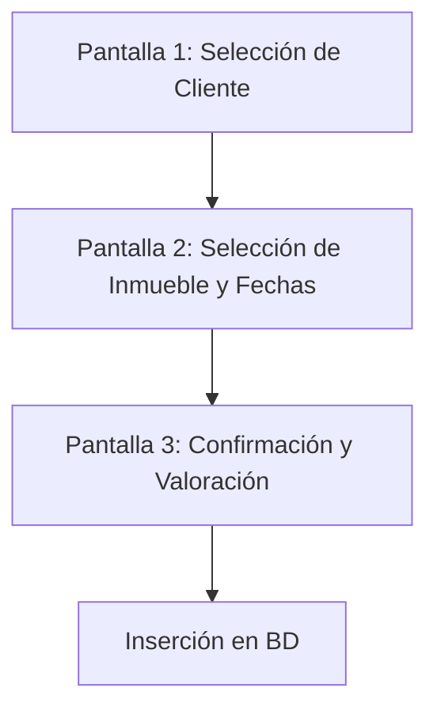
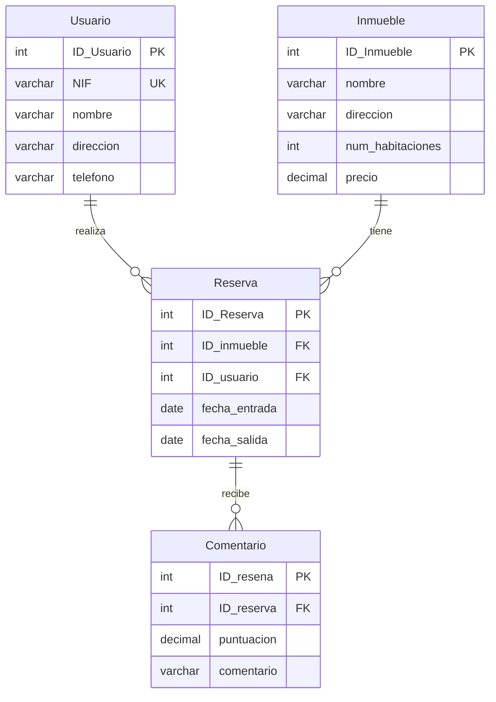
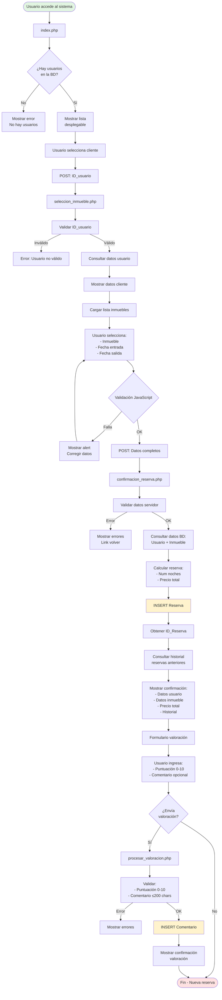
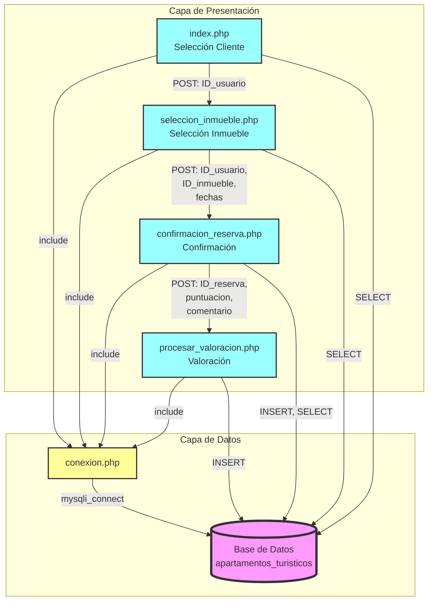

# 📘 MANUAL COMPLETO: GESTIÓN DE RESERVAS DE APARTAMENTOS TURÍSTICOS

## 📑 Índice
1. [Descripción del Proyecto](#descripción-del-proyecto)
2. [Análisis del Enunciado](#análisis-del-enunciado)
3. [Diseño de la Base de Datos](#diseño-de-la-base-de-datos)
4. [Estructura del Proyecto](#estructura-del-proyecto)
5. [Flujo de Ejecución](#flujo-de-ejecución)
6. [Implementación Detallada](#implementación-detallada)
7. [Validaciones Implementadas](#validaciones-implementadas)
8. [Guía de Instalación](#guía-de-instalación)
9. [Guía de Uso](#guía-de-uso)
10. [Resolución de Problemas](#resolución-de-problemas)

---

## 📋 Descripción del Proyecto

Este proyecto implementa un **sistema completo de gestión de reservas** para apartamentos turísticos. Permite a los usuarios realizar reservas, calcular precios automáticamente y valorar el servicio recibido.

### Objetivos del Ejercicio
- ✅ Diseñar una base de datos relacional con 4 tablas
- ✅ Implementar un proceso de reserva en 3 pasos
- ✅ Calcular precios basados en número de noches
- ✅ Mostrar historial de reservas del cliente
- ✅ Permitir valoración del servicio (puntuación y comentario)
- ✅ Validar todos los datos de entrada

---

## 🎯 Análisis del Enunciado

### Requisitos Funcionales Identificados

#### 1. Base de Datos (1 punto)
**Tablas requeridas:**
- **Usuario**: Información de los clientes
- **Inmueble**: Apartamentos disponibles
- **Reserva**: Registros de reservas
- **Comentario**: Valoraciones del servicio

#### 2. Proceso de Reserva (5.5 puntos)
**Flujo de 3 pantallas:**



**Pantalla 1 - Selección de Cliente:**
- Lista desplegable con todos los clientes
- Mostrar: nombre del cliente
- Formato: Nombre Completo

**Pantalla 2 - Selección de Inmueble y Fechas:**
- Lista desplegable con todos los inmuebles
- Mostrar: nombre del inmueble (ID)
- Ejemplo: "Caserón en Salamanca (1234)"
- Inputs para fecha de entrada y fecha de salida
- **Validaciones:**
  - Fechas mayores a la fecha actual
  - Fecha de salida > fecha de entrada

**Pantalla 3 - Confirmación:**
- Mostrar información completa de la reserva
- Calcular y mostrar precio total
- Mostrar lista de reservas anteriores del cliente
- Formulario para valorar la atención recibida

#### 3. Valoración del Servicio (3.5 puntos)
- Formulario con puntuación (0-10)
- Campo de comentario (opcional, máx 200 caracteres)
- Inserción en tabla Comentario

---

## 🗄️ Diseño de la Base de Datos

### Diagrama Entidad-Relación



### Especificaciones de Campos

#### Tabla Usuario
| Campo | Tipo | Restricciones | Descripción |
|-------|------|---------------|-------------|
| ID_Usuario | INT | PK, AUTO_INCREMENT | Identificador único |
| NIF | VARCHAR(9) | UNIQUE, NOT NULL | Documento de identidad |
| nombre | VARCHAR(50) | NOT NULL | Nombre completo |
| direccion | VARCHAR(50) | - | Dirección del usuario |
| telefono | VARCHAR(9) | - | Teléfono de contacto |

#### Tabla Inmueble
| Campo | Tipo | Restricciones | Descripción |
|-------|------|---------------|-------------|
| ID_Inmueble | INT | PK, AUTO_INCREMENT | Identificador único |
| nombre | VARCHAR(50) | NOT NULL | Nombre del apartamento |
| direccion | VARCHAR(50) | NOT NULL | Ubicación |
| num_habitaciones | INT | NOT NULL, >0 | Número de habitaciones |
| precio | DECIMAL(10,2) | NOT NULL, >0 | Precio por noche |

#### Tabla Reserva
| Campo | Tipo | Restricciones | Descripción |
|-------|------|---------------|-------------|
| ID_Reserva | INT | PK, AUTO_INCREMENT | Identificador único |
| ID_inmueble | INT | FK, NOT NULL | Referencia a Inmueble |
| ID_usuario | INT | FK, NOT NULL | Referencia a Usuario |
| fecha_entrada | DATE | NOT NULL | Fecha check-in |
| fecha_salida | DATE | NOT NULL, > fecha_entrada | Fecha check-out |

#### Tabla Comentario
| Campo | Tipo | Restricciones | Descripción |
|-------|------|---------------|-------------|
| ID_resena | INT | PK, AUTO_INCREMENT | Identificador único |
| ID_reserva | INT | FK, NOT NULL | Referencia a Reserva |
| puntuacion | DECIMAL(3,1) | NOT NULL, 0-10 | Valoración numérica |
| comentario | VARCHAR(200) | - | Opinión del cliente |

### Script SQL Completo

```sql
-- Crear base de datos
CREATE DATABASE IF NOT EXISTS apartamentos_turisticos;
USE apartamentos_turisticos;

-- Tabla Usuario
CREATE TABLE Usuario (
    ID_Usuario INT AUTO_INCREMENT PRIMARY KEY,
    NIF VARCHAR(9) NOT NULL UNIQUE,
    nombre VARCHAR(50) NOT NULL,
    direccion VARCHAR(50),
    telefono VARCHAR(9),
    CONSTRAINT chk_nif CHECK (LENGTH(NIF) = 9),
    CONSTRAINT chk_telefono CHECK (LENGTH(telefono) = 9)
) ENGINE=InnoDB DEFAULT CHARSET=utf8mb4;

-- Tabla Inmueble
CREATE TABLE Inmueble (
    ID_Inmueble INT AUTO_INCREMENT PRIMARY KEY,
    nombre VARCHAR(50) NOT NULL,
    direccion VARCHAR(50) NOT NULL,
    num_habitaciones INT NOT NULL,
    precio DECIMAL(10,2) NOT NULL,
    CONSTRAINT chk_habitaciones CHECK (num_habitaciones > 0),
    CONSTRAINT chk_precio CHECK (precio > 0)
) ENGINE=InnoDB DEFAULT CHARSET=utf8mb4;

-- Tabla Reserva
CREATE TABLE Reserva (
    ID_Reserva INT AUTO_INCREMENT PRIMARY KEY,
    ID_inmueble INT NOT NULL,
    ID_usuario INT NOT NULL,
    fecha_entrada DATE NOT NULL,
    fecha_salida DATE NOT NULL,
    FOREIGN KEY (ID_inmueble) REFERENCES Inmueble(ID_Inmueble) ON DELETE CASCADE,
    FOREIGN KEY (ID_usuario) REFERENCES Usuario(ID_Usuario) ON DELETE CASCADE,
    CONSTRAINT chk_fechas CHECK (fecha_salida > fecha_entrada)
) ENGINE=InnoDB DEFAULT CHARSET=utf8mb4;

-- Tabla Comentario
CREATE TABLE Comentario (
    ID_resena INT AUTO_INCREMENT PRIMARY KEY,
    ID_reserva INT NOT NULL,
    puntuacion DECIMAL(3,1) NOT NULL,
    comentario VARCHAR(200),
    FOREIGN KEY (ID_reserva) REFERENCES Reserva(ID_Reserva) ON DELETE CASCADE,
    CONSTRAINT chk_puntuacion CHECK (puntuacion >= 0 AND puntuacion <= 10)
) ENGINE=InnoDB DEFAULT CHARSET=utf8mb4;
```

---

## 📁 Estructura del Proyecto

```
ejercicio1_apartamentos/
│
├── database.sql                    # Script SQL completo
├── conexion.php                    # Archivo de conexión a BD
├── index.php                       # Pantalla 1: Selección cliente
├── seleccion_inmueble.php         # Pantalla 2: Inmueble y fechas
├── confirmacion_reserva.php       # Pantalla 3: Confirmación
└── procesar_valoracion.php        # Procesamiento de valoración
```

### Descripción de Archivos

#### 1. `database.sql`
- **Propósito**: Crear toda la estructura de la base de datos
- **Contenido**:
  - Creación de base de datos
  - Definición de 4 tablas con relaciones
  - Datos de prueba (usuarios, inmuebles, reservas, comentarios)
  - Consultas útiles comentadas

#### 2. `conexion.php`
- **Propósito**: Centralizar la conexión a MySQL
- **Parámetros**:
  - Servidor: localhost
  - Usuario: root
  - Contraseña: vacía
  - Base de datos: apartamentos_turisticos
- **Funciones**: Establece conexión mysqli y configura charset utf8mb4

#### 3. `index.php`
- **Propósito**: Primera pantalla del proceso
- **Funcionalidad**:
  - Consulta todos los usuarios de la BD
  - Muestra lista desplegable
  - Valida selección
  - Envía ID_usuario a siguiente página
- **Método**: POST

#### 4. `seleccion_inmueble.php`
- **Propósito**: Segunda pantalla del proceso
- **Funcionalidad**:
  - Recibe ID_usuario
  - Muestra datos del usuario seleccionado
  - Lista desplegable de inmuebles con formato especial
  - Inputs de fecha con validación HTML5
  - Validación JavaScript en cliente
  - Envía datos completos a confirmación
- **Método**: POST

#### 5. `confirmacion_reserva.php`
- **Propósito**: Tercera pantalla - Procesar y confirmar
- **Funcionalidad**:
  - Valida todos los datos recibidos
  - Calcula número de noches (diferencia de fechas)
  - Calcula precio total (noches × precio_noche)
  - Inserta reserva en BD
  - Consulta historial de reservas del cliente
  - Muestra resumen completo
  - Presenta formulario de valoración
- **Método**: POST

#### 6. `procesar_valoracion.php`
- **Propósito**: Guardar valoración en BD
- **Funcionalidad**:
  - Valida puntuación (0-10)
  - Valida longitud de comentario (máx 200)
  - Inserta en tabla Comentario
  - Muestra confirmación
- **Método**: POST

---

## 🔄 Flujo de Ejecución

### Diagrama de Flujo Completo



### Flujo de Datos

#### Paso 1: Selección de Cliente
```
[USUARIO] → Selecciona cliente desde desplegable
    ↓
[index.php] → Valida selección
    ↓
[POST] → ID_usuario
    ↓
[seleccion_inmueble.php]
```

#### Paso 2: Selección de Inmueble y Fechas
```
[seleccion_inmueble.php] → Recibe ID_usuario
    ↓
[BD Query] → SELECT usuario WHERE ID_Usuario = ?
    ↓
[BD Query] → SELECT inmuebles (todos)
    ↓
[FORMULARIO] → Usuario selecciona:
    • ID_inmueble
    • fecha_entrada
    • fecha_salida
    ↓
[JavaScript] → Validación cliente
    ↓
[POST] → ID_usuario, ID_inmueble, fecha_entrada, fecha_salida
    ↓
[confirmacion_reserva.php]
```

#### Paso 3: Confirmación y Valoración
```
[confirmacion_reserva.php] → Recibe datos POST
    ↓
[Validación Server] → Verificar datos
    ↓
[BD Query] → SELECT usuario, inmueble
    ↓
[Cálculo] → noches = DATEDIFF(salida, entrada)
[Cálculo] → precio_total = noches × precio_noche
    ↓
[BD INSERT] → INSERT INTO Reserva VALUES (...)
    ↓
[BD Query] → SELECT historial reservas WHERE ID_usuario = ?
    ↓
[MOSTRAR] → Confirmación completa + Historial
    ↓
[FORMULARIO] → Valoración (puntuación + comentario)
    ↓
[POST] → ID_reserva, puntuacion, comentario
    ↓
[procesar_valoracion.php]
    ↓
[BD INSERT] → INSERT INTO Comentario VALUES (...)
    ↓
[MOSTRAR] → Confirmación valoración
```

---

## 💻 Implementación Detallada

### Archivo 1: conexion.php

**Propósito**: Centralizar la lógica de conexión a la base de datos.

```php
<?php
/**
 * Archivo de conexión a la base de datos
 * Usar mysqli para compatibilidad con PHP 7+
 */

// Parámetros de conexión
$servidor = 'localhost';
$usuario = 'root';
$password = '';
$base_datos = 'apartamentos_turisticos';

// Conectar al servidor
$conex = mysqli_connect($servidor, $usuario, $password)
    or die("Error al conectar: " . mysqli_error($conex));

// Seleccionar la base de datos
mysqli_select_db($conex, $base_datos)
    or die("Error al seleccionar BD: " . mysqli_error($conex));

// Configurar charset para evitar problemas con acentos
mysqli_set_charset($conex, "utf8mb4");
?>
```

**Puntos clave:**
- Usar `mysqli_` (no `mysql_` obsoleto)
- Configurar charset utf8mb4 para caracteres especiales
- Mostrar errores con `mysqli_error()` durante desarrollo

---

### Archivo 2: index.php

**Análisis del Enunciado:**
> "En una primera pantalla, se ha de seleccionar al cliente entre un listado de clientes mostrado a través de una lista desplegable con el nombre de todos ellos."

**Implementación:**

```php
<?php
// 1. Incluir conexión
include 'conexion.php';

// 2. Consultar todos los usuarios
$query_usuarios = "SELECT ID_Usuario, nombre, NIF
                   FROM Usuario
                   ORDER BY nombre";
$resultado_usuarios = mysqli_query($conex, $query_usuarios);

// 3. Verificar si hay usuarios
$num_usuarios = mysqli_num_rows($resultado_usuarios);
if ($num_usuarios == 0) {
    // Mostrar mensaje de error
}

// 4. Generar formulario HTML
?>
<form action="seleccion_inmueble.php" method="POST">
    <select name="ID_usuario" required>
        <option value="">-- Seleccione un cliente --</option>
        <?php
        while ($usuario = mysqli_fetch_array($resultado_usuarios)) {
            echo '<option value="' . $usuario['ID_Usuario'] . '">';
            echo $usuario['nombre'] . ' (' . $usuario['NIF'] . ')';
            echo '</option>';
        }
        ?>
    </select>
    <button type="submit">Continuar →</button>
</form>
```

**Aspectos importantes:**
1. **Consulta SQL ordenada**: `ORDER BY nombre` para mejor UX
2. **Validación de existencia**: Verificar que hay usuarios antes de mostrar formulario
3. **Método POST**: Más seguro que GET para IDs
4. **Required HTML5**: Validación básica en cliente

---

### Archivo 3: seleccion_inmueble.php

**Análisis del Enunciado:**
> "Una vez seleccionado el cliente obtenemos una segunda pantalla, otra lista desplegable con el nombre de todos los inmuebles disponibles, así como su ID en entre paréntesis. Ej: Caserón en Salamanca (1234)."
>
> "Elegimos la fecha de entrada y la fecha de salida. Siempre mayores a la fecha actual y la fecha de salida mayor que la de entrada."

**Implementación (Partes clave):**

```php
<?php
session_start();
include 'conexion.php';

// 1. Validar ID_usuario recibido
if (!isset($_POST['ID_usuario']) || empty($_POST['ID_usuario'])) {
    die("Error: No se ha seleccionado ningún usuario.");
}

$ID_usuario = $_POST['ID_usuario'];
$_SESSION['ID_usuario'] = $ID_usuario;

// 2. Obtener datos del usuario
$query_usuario = "SELECT nombre, NIF FROM Usuario WHERE ID_Usuario = $ID_usuario";
$resultado_usuario = mysqli_query($conex, $query_usuario);
$datos_usuario = mysqli_fetch_array($resultado_usuario);

// 3. Obtener fecha actual para validaciones
$fecha_actual = date('Y-m-d');
?>

<!-- FORMULARIO HTML -->
<form action="confirmacion_reserva.php" method="POST" onsubmit="return validarFormulario()">
    <input type="hidden" name="ID_usuario" value="<?php echo $ID_usuario; ?>">

    <!-- Lista de Inmuebles con formato especial -->
    <select name="ID_inmueble" id="inmueble" required>
        <option value="">-- Seleccione un inmueble --</option>
        <?php
        $query_inmuebles = "SELECT ID_Inmueble, nombre, direccion, num_habitaciones, precio
                           FROM Inmueble
                           ORDER BY nombre";
        $resultado_inmuebles = mysqli_query($conex, $query_inmuebles);

        while ($inmueble = mysqli_fetch_array($resultado_inmuebles)) {
            echo '<option value="' . $inmueble['ID_Inmueble'] . '">';
            // Formato: Nombre (ID) - habitaciones - precio
            echo $inmueble['nombre'] . ' (' . $inmueble['ID_Inmueble'] . ') - ';
            echo $inmueble['num_habitaciones'] . ' hab. - ';
            echo number_format($inmueble['precio'], 2) . '€/noche';
            echo '</option>';
        }
        ?>
    </select>

    <!-- Campos de fecha con validación -->
    <input type="date" name="fecha_entrada" id="fecha_entrada" required>
    <input type="date" name="fecha_salida" id="fecha_salida" required>

    <button type="submit">Continuar →</button>
</form>

<script>
// Validación JavaScript en cliente
function validarFormulario() {
    var inmueble = document.getElementById('inmueble').value;
    var fechaEntrada = document.getElementById('fecha_entrada').value;
    var fechaSalida = document.getElementById('fecha_salida').value;

    if (!inmueble) {
        alert('Por favor, seleccione un inmueble.');
        return false;
    }

    if (!fechaEntrada || !fechaSalida) {
        alert('Por favor, seleccione las fechas de entrada y salida.');
        return false;
    }

    // Validar que fecha de salida > fecha de entrada
    if (fechaEntrada >= fechaSalida) {
        alert('La fecha de salida debe ser posterior a la fecha de entrada.');
        return false;
    }

    // Validar que las fechas sean futuras
    var hoy = new Date().toISOString().split('T')[0];
    if (fechaEntrada < hoy) {
        alert('La fecha de entrada debe ser igual o posterior a hoy.');
        return false;
    }

    return true;
}

// Configurar fecha mínima en los inputs
window.onload = function() {
    var hoy = new Date().toISOString().split('T')[0];
    document.getElementById('fecha_entrada').min = hoy;
    document.getElementById('fecha_salida').min = hoy;

    // Actualizar mínimo de fecha_salida cuando cambia fecha_entrada
    document.getElementById('fecha_entrada').addEventListener('change', function() {
        var fechaEntrada = this.value;
        if (fechaEntrada) {
            var fechaMinSalida = new Date(fechaEntrada);
            fechaMinSalida.setDate(fechaMinSalida.getDate() + 1);
            document.getElementById('fecha_salida').min =
                fechaMinSalida.toISOString().split('T')[0];
        }
    });
};
</script>
```

**Aspectos importantes:**
1. **Formato especial en desplegable**: "Nombre (ID)"
2. **Validación doble**: JavaScript (cliente) + PHP (servidor)
3. **Configuración dinámica de fechas mínimas**: Mejorar UX
4. **Pasar ID_usuario como campo oculto**: Mantener contexto

---

### Archivo 4: confirmacion_reserva.php

**Análisis del Enunciado:**
> "Una vez introducidas, se mostrará la información de la reserva con el precio total calculado, una lista de las reservas anteriores del cliente y un pequeño formulario para valorar la atención recibida sobre la reserva."

**Implementación (Partes clave):**

```php
<?php
session_start();
include 'conexion.php';

// ===== 1. VALIDACIÓN DE DATOS =====
$errores = array();

if (!isset($_POST['ID_usuario']) || empty($_POST['ID_usuario'])) {
    $errores[] = "No se ha especificado el usuario.";
}
$ID_usuario = isset($_POST['ID_usuario']) ? intval($_POST['ID_usuario']) : 0;

if (!isset($_POST['ID_inmueble']) || empty($_POST['ID_inmueble'])) {
    $errores[] = "No se ha seleccionado ningún inmueble.";
}
$ID_inmueble = isset($_POST['ID_inmueble']) ? intval($_POST['ID_inmueble']) : 0;

$fecha_entrada = isset($_POST['fecha_entrada']) ? $_POST['fecha_entrada'] : '';
$fecha_salida = isset($_POST['fecha_salida']) ? $_POST['fecha_salida'] : '';

// Validaciones de fechas
$fecha_actual = date('Y-m-d');
if ($fecha_entrada < $fecha_actual) {
    $errores[] = "La fecha de entrada debe ser igual o posterior a hoy.";
}
if ($fecha_salida <= $fecha_entrada) {
    $errores[] = "La fecha de salida debe ser posterior a la fecha de entrada.";
}

// Si hay errores, mostrarlos y detener
if (count($errores) > 0) {
    // Mostrar errores...
    exit();
}

// ===== 2. OBTENER INFORMACIÓN =====
// Usuario
$query_usuario = "SELECT nombre, NIF, direccion, telefono
                  FROM Usuario
                  WHERE ID_Usuario = $ID_usuario";
$resultado_usuario = mysqli_query($conex, $query_usuario);
$usuario = mysqli_fetch_array($resultado_usuario);

// Inmueble
$query_inmueble = "SELECT nombre, direccion, num_habitaciones, precio
                   FROM Inmueble
                   WHERE ID_Inmueble = $ID_inmueble";
$resultado_inmueble = mysqli_query($conex, $query_inmueble);
$inmueble = mysqli_fetch_array($resultado_inmueble);

// ===== 3. CALCULAR PRECIO TOTAL =====
$fecha_entrada_obj = new DateTime($fecha_entrada);
$fecha_salida_obj = new DateTime($fecha_salida);
$diferencia = $fecha_entrada_obj->diff($fecha_salida_obj);
$num_noches = $diferencia->days;

$precio_noche = $inmueble['precio'];
$precio_total = $num_noches * $precio_noche;

// ===== 4. INSERTAR RESERVA =====
$query_insert = "INSERT INTO Reserva (ID_inmueble, ID_usuario, fecha_entrada, fecha_salida)
                 VALUES ($ID_inmueble, $ID_usuario, '$fecha_entrada', '$fecha_salida')";

$resultado_insert = mysqli_query($conex, $query_insert);
if (!$resultado_insert) {
    die("Error al insertar la reserva: " . mysqli_error($conex));
}

// Obtener ID de la reserva recién creada
$ID_reserva_nueva = mysqli_insert_id($conex);
$_SESSION['ID_reserva_nueva'] = $ID_reserva_nueva;

// ===== 5. OBTENER HISTORIAL DE RESERVAS =====
$query_historial = "SELECT r.ID_Reserva, i.nombre as nombre_inmueble,
                    r.fecha_entrada, r.fecha_salida,
                    DATEDIFF(r.fecha_salida, r.fecha_entrada) as noches,
                    i.precio * DATEDIFF(r.fecha_salida, r.fecha_entrada) as precio_total
                    FROM Reserva r
                    INNER JOIN Inmueble i ON r.ID_inmueble = i.ID_Inmueble
                    WHERE r.ID_usuario = $ID_usuario AND r.ID_Reserva != $ID_reserva_nueva
                    ORDER BY r.fecha_entrada DESC";
$resultado_historial = mysqli_query($conex, $query_historial);
$num_reservas_anteriores = mysqli_num_rows($resultado_historial);

// ===== 6. MOSTRAR CONFIRMACIÓN HTML =====
?>
<!-- HTML: Mostrar datos completos de la reserva -->
<div class="reservation-details">
    <h3>Datos del Cliente</h3>
    <p>Nombre: <?php echo $usuario['nombre']; ?></p>
    <p>NIF: <?php echo $usuario['NIF']; ?></p>

    <h3>Datos del Inmueble</h3>
    <p>Nombre: <?php echo $inmueble['nombre']; ?></p>
    <p>Precio por noche: <?php echo number_format($precio_noche, 2); ?>€</p>

    <h3>Detalles de la Reserva</h3>
    <p>Nº de Reserva: #<?php echo $ID_reserva_nueva; ?></p>
    <p>Fecha entrada: <?php echo date('d/m/Y', strtotime($fecha_entrada)); ?></p>
    <p>Fecha salida: <?php echo date('d/m/Y', strtotime($fecha_salida)); ?></p>
    <p>Número de noches: <?php echo $num_noches; ?></p>

    <h2>PRECIO TOTAL: <?php echo number_format($precio_total, 2); ?>€</h2>
</div>

<!-- Historial de Reservas -->
<h2>Historial de Reservas del Cliente</h2>
<?php if ($num_reservas_anteriores > 0): ?>
    <table>
        <thead>
            <tr>
                <th>Nº Reserva</th>
                <th>Inmueble</th>
                <th>Entrada</th>
                <th>Salida</th>
                <th>Noches</th>
                <th>Total</th>
            </tr>
        </thead>
        <tbody>
            <?php while ($reserva = mysqli_fetch_array($resultado_historial)): ?>
                <tr>
                    <td>#<?php echo $reserva['ID_Reserva']; ?></td>
                    <td><?php echo $reserva['nombre_inmueble']; ?></td>
                    <td><?php echo date('d/m/Y', strtotime($reserva['fecha_entrada'])); ?></td>
                    <td><?php echo date('d/m/Y', strtotime($reserva['fecha_salida'])); ?></td>
                    <td><?php echo $reserva['noches']; ?></td>
                    <td><?php echo number_format($reserva['precio_total'], 2); ?>€</td>
                </tr>
            <?php endwhile; ?>
        </tbody>
    </table>
<?php else: ?>
    <p>Esta es la primera reserva del cliente. ¡Bienvenido!</p>
<?php endif; ?>

<!-- Formulario de Valoración -->
<div class="rating-form">
    <h3>Valorar la atención recibida</h3>
    <form action="procesar_valoracion.php" method="POST">
        <input type="hidden" name="ID_reserva" value="<?php echo $ID_reserva_nueva; ?>">

        <label>Puntuación (0-10):</label>
        <input type="number" name="puntuacion" min="0" max="10" step="0.1" required>

        <label>Comentario (opcional):</label>
        <textarea name="comentario" maxlength="200"></textarea>

        <button type="submit">Enviar Valoración</button>
    </form>
</div>
```

**Puntos clave:**
1. **Cálculo de noches**: Usar `DateTime` y `diff()`
2. **Cálculo de precio**: `noches × precio_noche`
3. **Historial con JOIN**: Unir Reserva con Inmueble
4. **Excluir reserva actual**: `WHERE ... AND r.ID_Reserva != $ID_reserva_nueva`
5. **mysqli_insert_id()**: Obtener ID auto-incremental

---

### Archivo 5: procesar_valoracion.php

**Análisis del Enunciado:**
> "Un pequeño formulario para valorar la atención recibida sobre la reserva."

**Implementación:**

```php
<?php
include 'conexion.php';

// ===== VALIDACIÓN =====
$errores = array();

$ID_reserva = isset($_POST['ID_reserva']) ? intval($_POST['ID_reserva']) : 0;
if ($ID_reserva <= 0) {
    $errores[] = "No se ha especificado el ID de la reserva.";
}

$puntuacion = isset($_POST['puntuacion']) ? floatval($_POST['puntuacion']) : 0;
if ($puntuacion < 0 || $puntuacion > 10) {
    $errores[] = "La puntuación debe estar entre 0 y 10.";
}

$comentario = isset($_POST['comentario']) ? trim($_POST['comentario']) : '';
if (strlen($comentario) > 200) {
    $errores[] = "El comentario no puede exceder los 200 caracteres.";
}

// Escapar caracteres especiales para SQL
$comentario = mysqli_real_escape_string($conex, $comentario);

if (count($errores) > 0) {
    // Mostrar errores...
    exit();
}

// ===== INSERTAR VALORACIÓN =====
$query_insert = "INSERT INTO Comentario (ID_reserva, puntuacion, comentario)
                 VALUES ($ID_reserva, $puntuacion, '$comentario')";

$resultado = mysqli_query($conex, $query_insert);
if (!$resultado) {
    die("Error al guardar la valoración: " . mysqli_error($conex));
}

// ===== MOSTRAR CONFIRMACIÓN =====
?>
<h1>¡Gracias por su valoración!</h1>
<p>Puntuación: <?php echo number_format($puntuacion, 1); ?>/10</p>
<?php if (!empty($comentario)): ?>
    <p>Comentario: "<?php echo htmlspecialchars($comentario); ?>"</p>
<?php endif; ?>
<a href="index.php">Nueva Reserva</a>
```

**Puntos clave:**
1. **Validar puntuación**: 0-10
2. **Validar longitud comentario**: Máximo 200 caracteres
3. **mysqli_real_escape_string()**: Prevenir inyección SQL
4. **htmlspecialchars()**: Prevenir XSS al mostrar

---

## ✅ Validaciones Implementadas

### Validaciones en Cliente (JavaScript)

#### En `seleccion_inmueble.php`:

```javascript
function validarFormulario() {
    // 1. Verificar que se seleccionó un inmueble
    var inmueble = document.getElementById('inmueble').value;
    if (!inmueble) {
        alert('Por favor, seleccione un inmueble.');
        return false;
    }

    // 2. Verificar que se ingresaron las fechas
    var fechaEntrada = document.getElementById('fecha_entrada').value;
    var fechaSalida = document.getElementById('fecha_salida').value;
    if (!fechaEntrada || !fechaSalida) {
        alert('Por favor, seleccione las fechas de entrada y salida.');
        return false;
    }

    // 3. Validar que fecha_salida > fecha_entrada
    if (fechaEntrada >= fechaSalida) {
        alert('La fecha de salida debe ser posterior a la fecha de entrada.');
        return false;
    }

    // 4. Validar que las fechas sean >= hoy
    var hoy = new Date().toISOString().split('T')[0];
    if (fechaEntrada < hoy) {
        alert('La fecha de entrada debe ser igual o posterior a hoy.');
        return false;
    }

    return true;
}
```

**Ventajas:**
- Respuesta inmediata al usuario
- Reduce carga del servidor
- Mejora experiencia de usuario

**Limitaciones:**
- Puede ser deshabilitado por el usuario
- No es seguro por sí solo
- Debe complementarse con validación en servidor

---

### Validaciones en Servidor (PHP)

#### En `confirmacion_reserva.php`:

```php
// Array para almacenar errores
$errores = array();

// 1. Validar ID de usuario
if (!isset($_POST['ID_usuario']) || empty($_POST['ID_usuario'])) {
    $errores[] = "No se ha especificado el usuario.";
}
$ID_usuario = isset($_POST['ID_usuario']) ? intval($_POST['ID_usuario']) : 0;

// 2. Validar ID de inmueble
if (!isset($_POST['ID_inmueble']) || empty($_POST['ID_inmueble'])) {
    $errores[] = "No se ha seleccionado ningún inmueble.";
}
$ID_inmueble = isset($_POST['ID_inmueble']) ? intval($_POST['ID_inmueble']) : 0;

// 3. Validar fechas
$fecha_entrada = isset($_POST['fecha_entrada']) ? $_POST['fecha_entrada'] : '';
$fecha_salida = isset($_POST['fecha_salida']) ? $_POST['fecha_salida'] : '';

if (empty($fecha_entrada)) {
    $errores[] = "No se ha especificado la fecha de entrada.";
}
if (empty($fecha_salida)) {
    $errores[] = "No se ha especificado la fecha de salida.";
}

// 4. Validar lógica de fechas
$fecha_actual = date('Y-m-d');
if ($fecha_entrada < $fecha_actual) {
    $errores[] = "La fecha de entrada debe ser igual o posterior a hoy.";
}
if ($fecha_salida <= $fecha_entrada) {
    $errores[] = "La fecha de salida debe ser posterior a la fecha de entrada.";
}

// 5. Si hay errores, mostrar y detener ejecución
if (count($errores) > 0) {
    echo "<h2>Errores de validación:</h2>";
    echo "<ul>";
    foreach ($errores as $error) {
        echo "<li>$error</li>";
    }
    echo "</ul>";
    echo '<a href="index.php">Volver al inicio</a>';
    exit();
}
```

**Ventajas:**
- Seguridad real
- No puede ser evitado por el usuario
- Validación definitiva antes de insertar en BD

---

### Validaciones en Base de Datos (SQL)

```sql
-- Restricciones CHECK
CONSTRAINT chk_nif CHECK (LENGTH(NIF) = 9)
CONSTRAINT chk_telefono CHECK (LENGTH(telefono) = 9)
CONSTRAINT chk_habitaciones CHECK (num_habitaciones > 0)
CONSTRAINT chk_precio CHECK (precio > 0)
CONSTRAINT chk_fechas CHECK (fecha_salida > fecha_entrada)
CONSTRAINT chk_puntuacion CHECK (puntuacion >= 0 AND puntuacion <= 10)

-- Restricciones de integridad referencial
FOREIGN KEY (ID_inmueble) REFERENCES Inmueble(ID_Inmueble) ON DELETE CASCADE
FOREIGN KEY (ID_usuario) REFERENCES Usuario(ID_Usuario) ON DELETE CASCADE
FOREIGN KEY (ID_reserva) REFERENCES Reserva(ID_Reserva) ON DELETE CASCADE

-- Restricciones de unicidad
UNIQUE (NIF)

-- Campos NOT NULL
NOT NULL
```

**Ventajas:**
- Capa final de seguridad
- Garantiza integridad de datos
- Independiente de la aplicación

---

## 🚀 Guía de Instalación

### Requisitos Previos

- **XAMPP** (o similar: WAMP, MAMP, LAMP)
  - Apache 2.4+
  - PHP 7.4+ o 8.x
  - MySQL 5.7+ o MariaDB 10.x
- **Navegador web moderno** (Chrome, Firefox, Edge, Safari)
- **Editor de texto** (VSCode, Sublime Text, Notepad++)

### Paso 1: Instalar XAMPP

1. Descargar XAMPP desde: https://www.apachefriends.org/
2. Ejecutar instalador
3. Seleccionar componentes: Apache, MySQL, PHP
4. Instalar en directorio por defecto (C:\xampp en Windows)

### Paso 2: Iniciar Servicios

1. Abrir **XAMPP Control Panel**
2. Hacer clic en **Start** para Apache
3. Hacer clic en **Start** para MySQL
4. Verificar que ambos servicios muestren "Running" en verde

### Paso 3: Crear la Base de Datos

#### Opción A: Usando phpMyAdmin (Recomendado)

1. Abrir navegador y acceder a: http://localhost/phpmyadmin/
2. Clic en pestaña **"SQL"**
3. Copiar y pegar todo el contenido del archivo `database.sql`
4. Hacer clic en **"Continuar"** o **"Go"**
5. Verificar mensaje de éxito

#### Opción B: Usando línea de comandos

```bash
# Windows
cd C:\xampp\mysql\bin
mysql -u root -p

# Dentro de MySQL
source C:/ruta/al/archivo/database.sql
```

### Paso 4: Copiar Archivos del Proyecto

1. Navegar a la carpeta **htdocs** de XAMPP:
   - Windows: `C:\xampp\htdocs\`
   - macOS: `/Applications/XAMPP/htdocs/`
   - Linux: `/opt/lampp/htdocs/`

2. Crear carpeta para el proyecto:
   ```
   htdocs/ejercicio1_apartamentos/
   ```

3. Copiar todos los archivos PHP del proyecto a esta carpeta:
   - conexion.php
   - index.php
   - seleccion_inmueble.php
   - confirmacion_reserva.php
   - procesar_valoracion.php

### Paso 5: Verificar Configuración de Conexión

Abrir `conexion.php` y verificar parámetros:

```php
$servidor = 'localhost';   // Correcto para instalación local
$usuario = 'root';          // Usuario por defecto de XAMPP
$password = '';             // Contraseña vacía por defecto
$base_datos = 'apartamentos_turisticos';
```

Si XAMPP tiene contraseña configurada para MySQL, actualizar `$password`.

### Paso 6: Probar la Instalación

1. Abrir navegador
2. Acceder a: http://localhost/ejercicio1_apartamentos/
3. Verificar que aparece la pantalla de selección de cliente
4. Verificar que hay clientes en el desplegable (datos de prueba)

### Paso 7: Verificar Datos de Prueba

En phpMyAdmin, ejecutar estas consultas para verificar:

```sql
-- Verificar usuarios
SELECT * FROM Usuario;

-- Verificar inmuebles
SELECT * FROM Inmueble;

-- Verificar reservas existentes
SELECT * FROM Reserva;

-- Verificar comentarios
SELECT * FROM Comentario;
```

Deberías ver datos en todas las tablas.

---

## 📖 Guía de Uso

### Flujo Completo de Reserva

#### Paso 1: Seleccionar Cliente

1. Acceder a http://localhost/ejercicio1_apartamentos/
2. En la lista desplegable, seleccionar un cliente existente
   - Ejemplo: "Juan Pérez García (12345678A)"
3. Hacer clic en **"Continuar →"**

**Capturas conceptuales:**
- [Pantalla con lista desplegable de clientes]
- [Cliente seleccionado: Juan Pérez García]

---

#### Paso 2: Seleccionar Inmueble y Fechas

1. Verificar que aparece el nombre del cliente seleccionado en el banner superior
2. En la lista desplegable de inmuebles, seleccionar uno:
   - Ejemplo: "Apartamento Centro Madrid (1) - 2 hab. - 85.50€/noche"
3. Seleccionar **Fecha de entrada**:
   - Hacer clic en el campo de fecha
   - Seleccionar una fecha igual o posterior a hoy
   - Ejemplo: Mañana
4. Seleccionar **Fecha de salida**:
   - Hacer clic en el campo de fecha
   - Seleccionar una fecha posterior a la fecha de entrada
   - Ejemplo: 5 días después de la entrada
5. Hacer clic en **"Continuar →"**

**Validaciones automáticas:**
- Si la fecha de entrada es anterior a hoy: Alert "La fecha de entrada debe ser igual o posterior a hoy"
- Si la fecha de salida ≤ fecha de entrada: Alert "La fecha de salida debe ser posterior a la fecha de entrada"

**Capturas conceptuales:**
- [Pantalla con desplegable de inmuebles]
- [Campos de fecha con calendario]
- [Alert de validación de fechas]

---

#### Paso 3: Confirmar Reserva

Al hacer clic en "Continuar", se procesa la reserva y aparece la pantalla de confirmación con:

1. **Sección: Datos del Cliente**
   - Nombre completo
   - NIF
   - Teléfono

2. **Sección: Datos del Inmueble**
   - Nombre del apartamento
   - Dirección
   - Número de habitaciones
   - Precio por noche

3. **Sección: Detalles de la Reserva**
   - Número de reserva (ID auto-generado)
   - Fecha de entrada (formato dd/mm/yyyy)
   - Fecha de salida (formato dd/mm/yyyy)
   - Número de noches calculado
   - **PRECIO TOTAL** (destacado)

4. **Tabla: Historial de Reservas del Cliente**
   - Si el cliente tiene reservas anteriores, se muestran en tabla:
     - Nº Reserva
     - Inmueble
     - Entrada
     - Salida
     - Noches
     - Total
   - Si es la primera reserva: "Esta es la primera reserva del cliente. ¡Bienvenido!"

5. **Formulario: Valorar la atención recibida**
   - Campo numérico: Puntuación (0-10)
   - Campo de texto: Comentario (opcional, máx 200 caracteres)
   - Botón: "Enviar Valoración"

**Capturas conceptuales:**
- [Pantalla de confirmación completa]
- [Detalle del precio total destacado]
- [Tabla de historial de reservas]
- [Formulario de valoración]

---

#### Paso 4: Valorar el Servicio

1. En el formulario de valoración, ingresar puntuación:
   - Ejemplo: 8.5
2. Opcionalmente, escribir un comentario:
   - Ejemplo: "Excelente atención, muy profesionales"
3. Hacer clic en **"Enviar Valoración"**

**Validaciones:**
- Puntuación obligatoria
- Puntuación entre 0 y 10
- Comentario máximo 200 caracteres

**Resultado:**
Aparece pantalla de confirmación de valoración con:
- Icono de estrella
- Mensaje de agradecimiento
- Puntuación otorgada (destacada)
- Comentario (si se ingresó)
- Botón para realizar nueva reserva

**Capturas conceptuales:**
- [Pantalla de confirmación de valoración]
- [Puntuación 8.5/10 destacada]
- [Comentario del usuario mostrado]

---

### Casos de Uso Especiales

#### Caso 1: Cliente sin Historial de Reservas

- **Situación**: Primera reserva del cliente
- **Resultado**: Se muestra mensaje "Esta es la primera reserva del cliente. ¡Bienvenido!"
- **Tabla de historial**: No se muestra

#### Caso 2: Cliente con Múltiples Reservas

- **Situación**: Cliente tiene 3+ reservas anteriores
- **Resultado**: Tabla completa con todas las reservas previas ordenadas por fecha descendente
- **Información**: Permite al cliente ver su historial completo

#### Caso 3: Reserva de Larga Estancia

- **Situación**: Reserva de 30 noches
- **Cálculo automático**:
  - Precio por noche: 85.50€
  - Número de noches: 30
  - Precio total: 2,565.00€
- **Formato**: Se muestra con formato de moneda español (coma decimal, punto miles)

#### Caso 4: Valoración sin Comentario

- **Situación**: Usuario ingresa solo puntuación
- **Resultado**: Se guarda valoración exitosamente
- **Confirmación**: Solo se muestra puntuación, no aparece sección de comentario

---

## 🔧 Resolución de Problemas

### Problema 1: "Error al conectar con el servidor"

**Síntoma**: Al abrir index.php aparece mensaje de error de conexión.

**Causas posibles:**
1. MySQL no está iniciado
2. Parámetros incorrectos en conexion.php
3. Base de datos no creada

**Soluciones:**

```bash
# Verificar estado de MySQL en XAMPP Control Panel
# Debe mostrar "Running" en verde

# Si MySQL no inicia:
# 1. Verificar que puerto 3306 no esté ocupado
# 2. Revisar logs de MySQL en XAMPP
# 3. Reiniciar servicios de XAMPP
```

Verificar `conexion.php`:
```php
// Asegurarse de que los parámetros son correctos
$servidor = 'localhost';
$usuario = 'root';
$password = '';  // Vacío si es instalación por defecto
```

---

### Problema 2: "Error al seleccionar la base de datos"

**Síntoma**: Conexión exitosa pero error al seleccionar BD.

**Causa**: Base de datos `apartamentos_turisticos` no existe.

**Solución:**

1. Acceder a phpMyAdmin: http://localhost/phpmyadmin/
2. Verificar que existe la base de datos `apartamentos_turisticos`
3. Si no existe, ejecutar nuevamente `database.sql`

```sql
-- Verificar bases de datos existentes
SHOW DATABASES;

-- Si no aparece, crear manualmente
CREATE DATABASE IF NOT EXISTS apartamentos_turisticos;
USE apartamentos_turisticos;
-- Luego ejecutar el resto del script
```

---

### Problema 3: No aparecen clientes en el desplegable

**Síntoma**: Lista desplegable vacía o mensaje "No hay usuarios registrados".

**Causa**: Tabla Usuario sin datos.

**Solución:**

Ejecutar en phpMyAdmin:

```sql
-- Verificar si hay usuarios
SELECT * FROM Usuario;

-- Si está vacía, insertar datos de prueba
INSERT INTO Usuario (NIF, nombre, direccion, telefono) VALUES
('12345678A', 'Juan Pérez García', 'C/ Mayor 15, Madrid', '654321987'),
('23456789B', 'María López Ruiz', 'Avda. Constitución 23, Sevilla', '612345678'),
('34567890C', 'Pedro Martínez Sanz', 'C/ Alcalá 45, Madrid', '698765432');
```

---

### Problema 4: Error "Call to undefined function mysqli_connect()"

**Síntoma**: Error de función indefinida al ejecutar PHP.

**Causa**: Extensión mysqli no habilitada en PHP.

**Solución:**

1. Localizar archivo `php.ini`:
   - Windows: `C:\xampp\php\php.ini`
   - Linux/Mac: `/opt/lampp/etc/php.ini`

2. Buscar línea:
   ```ini
   ;extension=mysqli
   ```

3. Quitar el punto y coma (descomentar):
   ```ini
   extension=mysqli
   ```

4. Reiniciar Apache desde XAMPP Control Panel

---

### Problema 5: Caracteres con acentos se ven mal (ñ, é, etc.)

**Síntoma**: Acentos y caracteres especiales se muestran incorrectamente.

**Causa**: Problema de codificación de caracteres.

**Solución:**

1. Verificar que `conexion.php` tiene:
   ```php
   mysqli_set_charset($conex, "utf8mb4");
   ```

2. Agregar en el `<head>` de todos los archivos PHP:
   ```html
   <meta charset="UTF-8">
   ```

3. Verificar que los archivos PHP están guardados con codificación UTF-8:
   - En VSCode: Ver → Codificación → UTF-8

4. En phpMyAdmin, verificar collation de la BD:
   - Base de datos → Operaciones
   - Cotejamiento: utf8mb4_general_ci

---

### Problema 6: Fechas no se validan correctamente

**Síntoma**: Se pueden seleccionar fechas pasadas o fecha salida < fecha entrada.

**Causa**: JavaScript deshabilitado o validación servidor no funciona.

**Solución:**

Asegurarse de que `seleccion_inmueble.php` tiene:

```javascript
// Al cargar la página, establecer fechas mínimas
window.onload = function() {
    var hoy = new Date().toISOString().split('T')[0];
    document.getElementById('fecha_entrada').min = hoy;
    document.getElementById('fecha_salida').min = hoy;
};
```

Y que `confirmacion_reserva.php` valida en servidor:

```php
$fecha_actual = date('Y-m-d');
if ($fecha_entrada < $fecha_actual) {
    $errores[] = "La fecha de entrada debe ser igual o posterior a hoy.";
}
if ($fecha_salida <= $fecha_entrada) {
    $errores[] = "La fecha de salida debe ser posterior a la fecha de entrada.";
}
```

---

### Problema 7: Error "Duplicate entry" al insertar reserva

**Síntoma**: Error MySQL al intentar crear reserva.

**Causa**: Restricción UNIQUE violada (poco probable con ID auto-incremental) o problema de PK.

**Solución:**

1. Verificar estructura de tabla Reserva:
   ```sql
   DESCRIBE Reserva;
   ```

2. Verificar que ID_Reserva es AUTO_INCREMENT:
   ```sql
   SHOW CREATE TABLE Reserva;
   ```

3. Si es necesario, reparar secuencia:
   ```sql
   ALTER TABLE Reserva AUTO_INCREMENT = 1;
   ```

---

### Problema 8: Puntuación acepta valores fuera de rango (< 0 o > 10)

**Síntoma**: Se pueden ingresar valores como -5 o 15.

**Causa**: Validación HTML5 o JavaScript no funciona.

**Solución:**

Asegurarse de que el input tiene atributos correctos:

```html
<input type="number" name="puntuacion" id="puntuacion"
       min="0" max="10" step="0.1" required>
```

Y validar en servidor (`procesar_valoracion.php`):

```php
$puntuacion = isset($_POST['puntuacion']) ? floatval($_POST['puntuacion']) : 0;
if ($puntuacion < 0 || $puntuacion > 10) {
    $errores[] = "La puntuación debe estar entre 0 y 10.";
}
```

---

### Problema 9: No se guarda el comentario en la BD

**Síntoma**: Puntuación se guarda pero comentario aparece vacío.

**Causa**: Caracteres especiales no escapados causan error SQL silencioso.

**Solución:**

Usar `mysqli_real_escape_string()`:

```php
$comentario = isset($_POST['comentario']) ? trim($_POST['comentario']) : '';
$comentario = mysqli_real_escape_string($conex, $comentario);
```

---

### Problema 10: "mysqli_fetch_array() expects parameter 1 to be mysqli_result"

**Síntoma**: Error al procesar resultado de consulta.

**Causa**: Consulta SQL falló y devolvió FALSE en lugar de resultado.

**Solución:**

Siempre verificar resultado de consulta:

```php
$query = "SELECT * FROM Usuario WHERE ID_Usuario = $ID_usuario";
$resultado = mysqli_query($conex, $query);

if (!$resultado) {
    die("Error en consulta: " . mysqli_error($conex));
}

// Ahora es seguro usar mysqli_fetch_array
$datos = mysqli_fetch_array($resultado);
```

---

## 📊 Diagrama de Dependencias



---

## 🎓 Conclusiones y Aprendizajes Clave

### Conceptos Fundamentales Aplicados

1. **Diseño de Base de Datos Relacional**
   - Normalización correcta (3NF)
   - Relaciones 1:N mediante claves foráneas
   - Constraints para integridad de datos

2. **Patrón MVC Simplificado**
   - Separación de lógica y presentación
   - Reutilización de código (conexion.php)
   - Flujo claro de datos entre pantallas

3. **Validación en Capas**
   - Cliente (JavaScript): UX inmediata
   - Servidor (PHP): Seguridad real
   - Base de Datos (SQL): Integridad final

4. **Cálculos con Fechas en PHP**
   - Uso de `DateTime` y `DateInterval`
   - Cálculo de diferencias (`diff()`)
   - Formato de fechas para display

5. **Manejo de Formularios POST**
   - Recepción y sanitización de datos
   - Validación de tipos
   - Prevención de inyección SQL

### Buenas Prácticas Implementadas

✅ **Seguridad**:
- Validación doble (cliente + servidor)
- `mysqli_real_escape_string()` para prevenir SQL injection
- `htmlspecialchars()` para prevenir XSS
- `intval()` y `floatval()` para sanitizar números

✅ **Usabilidad**:
- Mensajes de error claros
- Confirmaciones visuales
- Historial para contexto
- Botones de navegación

✅ **Mantenibilidad**:
- Comentarios explicativos
- Código estructurado
- Nombres descriptivos
- Separación de responsabilidades

✅ **Funcionalidad**:
- Cálculos automáticos
- Formato de moneda correcto
- Fechas en formato español
- Inserción y consulta eficientes

---

## 📚 Referencias y Recursos

### Documentación Oficial
- [PHP Manual - mysqli](https://www.php.net/manual/es/book.mysqli.php)
- [MySQL Reference Manual](https://dev.mysql.com/doc/)
- [HTML5 Specification](https://html.spec.whatwg.org/)
- [JavaScript MDN Web Docs](https://developer.mozilla.org/es/)

### Tutoriales Recomendados
- [W3Schools PHP MySQL](https://www.w3schools.com/php/php_mysql_intro.asp)
- [PHP The Right Way](https://phptherightway.com/)

### Herramientas Útiles
- [XAMPP](https://www.apachefriends.org/)
- [phpMyAdmin](https://www.phpmyadmin.net/)
- [Visual Studio Code](https://code.visualstudio.com/)

---

## ✅ Checklist de Entrega

Antes de entregar el ejercicio, verificar:

- [ ] Base de datos creada con todas las tablas
- [ ] Datos de prueba insertados correctamente
- [ ] Archivo `database.sql` incluido en la entrega
- [ ] Todos los archivos PHP funcionan sin errores
- [ ] Validaciones funcionan correctamente
- [ ] Cálculos de precio son correctos
- [ ] Historial de reservas se muestra correctamente
- [ ] Valoración se guarda en la base de datos
- [ ] Formato de fechas es español (dd/mm/yyyy)
- [ ] No hay errores de acentos o caracteres especiales
- [ ] Código está comentado adecuadamente
- [ ] Proyecto comprimido en .zip con formato correcto

**Formato de entrega**: `[inicial_nombre][primer_apellido]_WPHPDic23.zip`

Ejemplo: `calvarez_WPHPDic23.zip`

**Contenido del .zip:**
```
calvarez_WPHPDic23.zip
├── database.sql
├── conexion.php
├── index.php
├── seleccion_inmueble.php
├── confirmacion_reserva.php
└── procesar_valoracion.php
```

---

**Fin del Manual - Ejercicio 1: Gestión de Reservas de Apartamentos Turísticos**

---

*Manual creado con fines educativos para el curso de Desarrollo de Sitios Web con PHP y MySQL*
